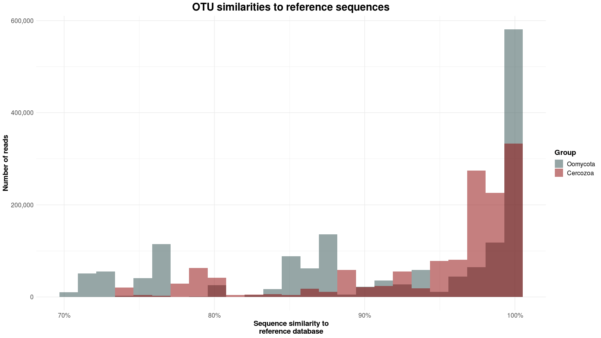
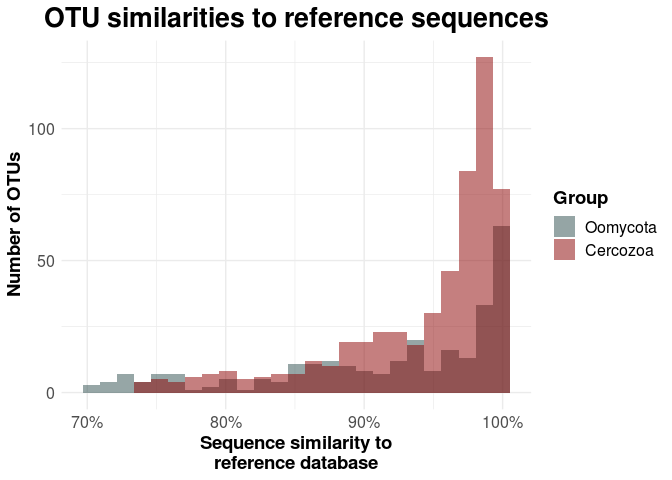

Plot sequence similarity to reference database
================

Sequence similarity to reference sequences
==========================================

Let's check how the sequence similarity of our OTUs is distributed. Basically we plot the percentage of identity from our taxonomic annotation against the number of sequences in a histogram.

Load the data
-------------

First we need to load the data. The Taxonomy file is needed for the percent identity, while the OTU table will be used to calculate the total abundance of each OTU:

``` r
rm(list = ls())

library(ggplot2)
library(plyr)
library(ggpubr)

#setwd("02_Taxonomic_Annotation_and_Visualisation/")

TAX = read.csv("../00_Data/Oomycota/04_OwnSamples_OTU_ContingencyTable_filtered_sequences_NCBI-nt_blasted_sorted_BestHit-TaxonomyTable_Oomycetes_sequences_vsearch-ITS1-BestHit_AnnotationRefined_noPipe.tsv", 
                    header = F, 
                    sep = "\t", 
                    stringsAsFactors = T)
OTU_Table = as.data.frame(read.csv("../00_Data/Oomycota/05_OwnSamples_OTU_Table_min-freq-9588_transposed_withMetadata.tsv", 
                     header = T, 
                     sep = "\t", 
                     stringsAsFactors = T))

SampleMetadata = OTU_Table[,1:5]
OTU_Table = OTU_Table[,6:ncol(OTU_Table)]

Abundances = colSums(OTU_Table)
TAX = cbind(TAX, Abundances)

colnames(TAX) = c("OTU_Number", "Order", "Family", "Genus", "Species", "ReferenceID", "PercentID", "Abundance")
TAX$OTU_ID = paste0("OTU", TAX$OTU_Number, "_", TAX$Species)
```

Prepare the table for the Histogram
-----------------------------------

Basically we now have two options: We can either round the identiy value and concatenate the OTUs with the same rounded identity - which can then be plotted in a simple bar chart, or we expand the table to make it readable for `geom_histogram`.

Here I stick with the second option, but nevertheless I round the percent identity just in case you want to try the first option.

``` r
# This function rounds the value to the provided base
mround <- function(x,base){
    base*round(x/base)
} 

# Here I divided by 100 to obtain values between 0 and 1
TAX$PercentIDrounded = mround(TAX$PercentID, 1) / 100
# You can also round to the nearest e.g. 5% by putting "5" instead of "1"

# Aggregate Abundances with the same percent identity
PercentID = TAX$PercentID
AggregatedTAXpercent = ddply(TAX, "PercentID", numcolwise(sum))
AggregatedTAXpercent$PercentID = AggregatedTAXpercent$PercentID / 100

# Expand the table. 
# This means that if e.g. 1000 sequences have the percent identity of 70.5 we print 70.5 1000 times
AggregatedTAXpercent_expanded = AggregatedTAXpercent[rep(row.names(AggregatedTAXpercent), AggregatedTAXpercent$Abundance), c(1,3)]
```

Combine Oomycete and Cercozoa data
----------------------------------

We can also combine the data from the Oomycetes with the Cercozoa data. To do so, we run everything again on the cerco tables:

``` r
Cerco_TAX = read.csv("../00_Data/Cercozoa/04_Cercozoa_OwnSamples_OTU_ContingencyTable_filtered_sequences_NCBI-nt_blasted_sorted_BestHit-TaxonomyTable_Cercozoa_sequences_vsearch-V4-BestHit_AnnotationRefined_noPipe.tsv", 
                    header = F, 
                    sep = "\t", 
                    stringsAsFactors = T)
Cerco_OTU_Table = as.data.frame(read.csv("../00_Data/Cercozoa/05_Cercozoa_OwnSamples_OTU_Table_min-freq-15684_transposed_withMetadata.tsv", 
                     header = T, 
                     sep = "\t", 
                     stringsAsFactors = T))

Cerco_SampleMetadata = Cerco_OTU_Table[,1:5]
Cerco_OTU_Table = Cerco_OTU_Table[,6:ncol(Cerco_OTU_Table)]
Cerco_Abundances = colSums(Cerco_OTU_Table)
Cerco_TAX = cbind(Cerco_TAX, Cerco_Abundances)

colnames(Cerco_TAX) = c("OTU_Number", "Order", "Family", "Genus", "Species", "ReferenceID", "PercentID", "Abundance")
Cerco_TAX$OTU_ID = paste0("OTU", Cerco_TAX$OTU_Number, "_", Cerco_TAX$Species)

Cerco_TAX$PercentIDrounded = mround(Cerco_TAX$PercentID, 1) / 100
Cerco_AggregatedTAXpercent = ddply(Cerco_TAX, "PercentID", numcolwise(sum))
Cerco_AggregatedTAXpercent$PercentID = Cerco_AggregatedTAXpercent$PercentID / 100

Cerco_AggregatedTAXpercent_expanded = Cerco_AggregatedTAXpercent[rep(row.names(Cerco_AggregatedTAXpercent), Cerco_AggregatedTAXpercent$Abundance), c(1,3)]
```

Plot the sequence similarity
----------------------------

Next we add the group (Oomycota and Cercozoa, respectively) which we will use to fill the two different histograms. Then we combine the data and load it into `ggplot`

``` r
AggregatedTAXpercent_expanded$Group = "Oomycota"
Cerco_AggregatedTAXpercent_expanded$Group = "Cercozoa"

HistoData = rbind.data.frame(AggregatedTAXpercent_expanded, Cerco_AggregatedTAXpercent_expanded)

# The data needs to be subsetted to exclude all abundances for a percent ID of 0
g = ggplot(AggregatedTAXpercent_expanded[AggregatedTAXpercent_expanded > 0, ], aes(x = PercentID)) +
  geom_histogram(aes(y = ..count.., fill = Group, alpha = Group), 
               alpha = 0.5, 
               color = NA, 
               bins = 25) +
  geom_histogram(data = Cerco_AggregatedTAXpercent_expanded[Cerco_AggregatedTAXpercent_expanded > 0, ], 
                 aes(x = PercentID, y = ..count.., fill = Group, alpha = Group), 
                 alpha = 0.5, 
                 color = NA, 
                 bins = 25) +
  scale_fill_manual(values = c("darkslategrey", "darkred"), 
                    limits = c("Oomycota", "Cercozoa")) +
  scale_x_continuous(labels = scales::percent_format(accuracy = 1)) + 
  scale_y_continuous(labels = scales::comma) +
  theme_minimal() +
  labs(x = "Sequence similarity to reference database", 
       y = "Number of reads", 
       title = "OTU similarities to reference sequences") +
  theme(axis.text=element_text(size=12), 
        axis.title=element_text(size=14, face = "bold"), 
        plot.title = element_text(size = 20, face = "bold", hjust = 0.5), 
        legend.text = element_text(size = 12), 
        legend.title = element_text(size = 14, face = "bold")) +
  guides(fill = guide_legend(override.aes = list(alpha = 0.3)))

g
```



Most sequences can be assigned to a reference sequence by nearly 100%, which is very good. However, for the oomycetes we have two interesting peaks at ca. 76% and 88%.

This means that many sequences can be assigned to at least an order or a family, but we are lacking closely related reference sequences. What we observe here might be hitherto undescribed genetic lineages, depicting a *hidden diversity* in our samples.

Number of OTUs
--------------

Let's do the same but not for the number of reads, but for the number of OTUs. Here we need the "regular" taxonomy table from both groups:

``` r
TAX_subset = subset(TAX, select = "PercentID")
TAX_subset$Group = "Oomycota"
TAX_subset$PercentID = TAX_subset$PercentID / 100

Cerco_TAX_subset = subset(Cerco_TAX, select = "PercentID")
Cerco_TAX_subset$Group = "Cercozoa"
Cerco_TAX_subset$PercentID = Cerco_TAX_subset$PercentID / 100

g_OTU = ggplot(TAX_subset[TAX_subset$PercentID > 0, ], aes(x = PercentID)) +
  geom_histogram(aes(y = ..count.., fill = Group, alpha = Group), 
               alpha = 0.5, 
               color = NA, 
               bins = 25) +
  geom_histogram(data = Cerco_TAX_subset[Cerco_TAX_subset$PercentID > 0, ], 
                 aes(x = PercentID, y = ..count.., fill = Group, alpha = Group), 
                 alpha = 0.5, 
                 color = NA, 
                 bins = 25) +
  scale_fill_manual(values = c("darkslategrey", "darkred"), 
                    limits = c("Oomycota", "Cercozoa")) +
  scale_x_continuous(labels = scales::percent_format(accuracy = 1)) + 
  theme_minimal() +
  labs(x = "Sequence similarity to reference database", 
       y = "Number of OTUs", 
       title = "OTU similarities to reference sequences") +
  theme(axis.text=element_text(size=12), 
        axis.title=element_text(size=14, face = "bold"), 
        plot.title = element_text(size = 20, face = "bold", hjust = 0.5), 
        legend.text = element_text(size = 12), 
        legend.title = element_text(size = 14, face = "bold")) +
  guides(fill = guide_legend(override.aes = list(alpha = 0.3)))

g_OTU
```



Interestingly, most OTUs also account for most reads with a ~100% similarity to references. However, the two peaks at ca. 76% and 88% are only due to few OTUs. This means that few OTUs (but with a very high abundance!) may represent new undescribed lineages in our samples.

``` r
g$labels$title = NULL
g_OTU$labels$title = NULL
g$labels$x = NULL
g_OTU$labels$x = NULL

combi = ggarrange(g, g_OTU, 
                  labels = c("A", "B"), 
                  ncol = 2, nrow = 1, 
                  common.legend = T, legend = "bottom", 
                  align = "h", vjust = 2.5) #%>%
  #annotate_figure(fig.lab = "Figure X", fig.lab.face = "bold", 
  #                fig.lab.size = 18, 
  #                top = text_grob("OTU and Read similarities to reference sequences", 
  #                                face = "bold", size = 20), 
  #                bottom = text_grob("Sequence similarity to reference sequences", 
  #                                face = "bold", size = 20))

ggsave("SequenceSimilarityCombined.pdf", plot = combi, 
       device = "pdf", dpi = 600, width = 16, height = 9, 
       units = "cm")
ggsave("SequenceSimilarityCombined.tif", plot = combi, 
       device = "tiff", dpi = 600, width = 16, height = 9, 
       units = "cm")
ggsave("SequenceSimilarityCombined.png", plot = combi, 
       device = "png", dpi = 600, width = 16, height = 9, 
       units = "cm")
```
