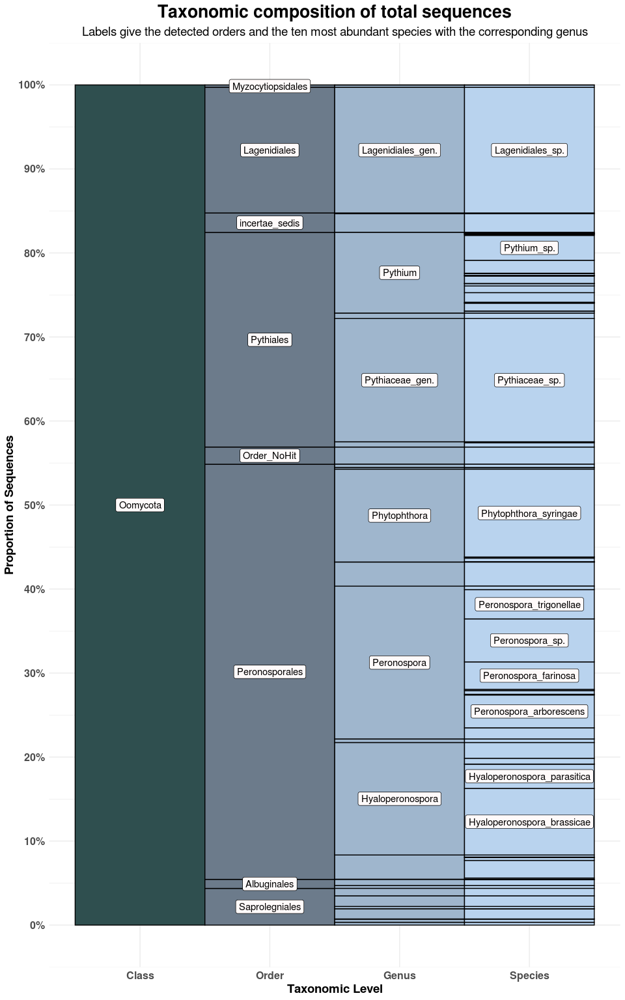
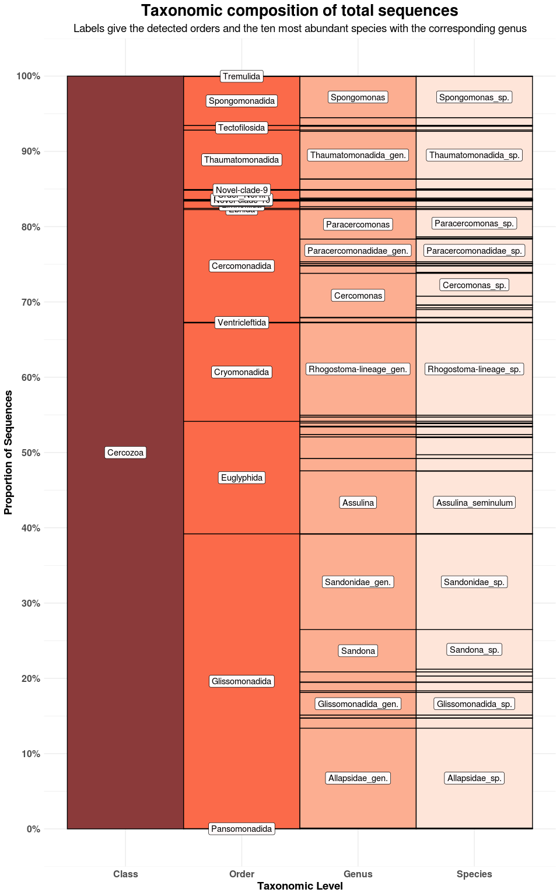

Taxonomic Composition
================

Before, we visualised the taxonomic composition by plotting the sequence similarity to a reference database. Now, we go into more detail with the taxonomy itself. Here we construct a hierarchical graph across several taxonomic levels and plot the proportion of each composition.

Prepare the data
----------------

Load the data. We need both the OTU Table and the taxonomy file. To the latter, we add the total abundance of every OTU.

``` r
rm(list = ls())

library(igraph)
library(magrittr)
library(ggraph)
library(ggplot2)
library(plyr)
library(ggpubr)

#setwd("02_Taxonomic_Annotation_and_Visualisation/")

TAX = read.csv("../00_Data/Oomycota/04_OwnSamples_OTU_ContingencyTable_filtered_sequences_NCBI-nt_blasted_sorted_BestHit-TaxonomyTable_Oomycetes_sequences_vsearch-ITS1-BestHit_AnnotationRefined_noPipe.tsv", 
                    header = F, 
                    sep = "\t", 
                    stringsAsFactors = T)
OTU_Table = as.data.frame(read.csv("../00_Data/Oomycota/05_OwnSamples_OTU_Table_min-freq-9588_transposed_withMetadata.tsv", 
                     header = T, 
                     sep = "\t", 
                     stringsAsFactors = T))

SampleMetadata = OTU_Table[,1:5]
OTU_Table = OTU_Table[,6:ncol(OTU_Table)]

Abundances = colSums(OTU_Table)
TAX = cbind(TAX, Abundances)

colnames(TAX) = c("OTU_Number", "Order", "Family", "Genus", "Species", "ReferenceID", "PercentID", "Abundance")
TAX$OTU_ID = paste0("OTU", TAX$OTU_Number, "_", TAX$Species)
TAX$Class = "Oomycota"
```

Prepare Graph
-------------

The Graph consists of Nodes and Edges, which are pairwise combinations. The nodes are the final edges (=OTUs) and their abundance. The edges should look something like this:

Oomycota Pythiales Pythiales Pythiaceae Pythiaceae Pythium Pythium Pythium\_sp.

This file format can be interpreted by several applications, like `igraph` in this case.

But first, we need to aggregate all OTUs that have the same taxonomic hit:

``` r
# aggregate same species and sum their abundance
TAX_aggregated = ddply(TAX, "Species", numcolwise(sum))
# skip the family because it's quite redundant with the order
TAX = subset(TAX, select = c("Class", "Order", "Genus", "Species"))
TAX = TAX[order(TAX[,"Species"]),]

TAX_tmp0 = cbind.data.frame(Node1 = TAX$Class, Node.2 = TAX$Order)
TAX_tmp1 = cbind.data.frame(Node1 = TAX$Order, Node.2 = TAX$Genus)
#TAX_tmp2 = cbind.data.frame(Node1 = TAX$Family, Node.2 = TAX$Genus)
TAX_tmp3 = cbind.data.frame(Node1 = TAX$Genus, Node.2 = TAX$Species)
TAX_nodes = cbind.data.frame(Node1 = TAX_aggregated$Species, size = TAX_aggregated$Abundance)

# Here we extract the "non-leaf" levels, like Order and Genus
# then we set their abundance to 0
Others = cbind.data.frame(Node1 = c(as.character(TAX$Class), 
                                    as.character(TAX$Order), 
                                    #as.character(TAX$Family), 
                                    as.character(TAX$Genus)), 
                          size = 0) %>% unique()

Others$size = as.numeric(Others$size)
TAX_nodes = rbind(Others, TAX_nodes)
TAX_tree = rbind(TAX_tmp0, 
                 TAX_tmp1, 
                 #TAX_tmp2, 
                 TAX_tmp3)
TAX_nodes$size = as.numeric(TAX_nodes$size)
```

Contruct edges and vertices
---------------------------

Next we filter some vertices, because plotting all genera and species can be quite messy in the graph. The nodes themselves will still appear, this step is just for the labels. We will label all orders together with the ten most abundant species with the respective genus.

``` r
edges = as.data.frame(TAX_tree)
vertices = as.data.frame(TAX_nodes)
vertices$size = as.numeric(vertices$size)

# mask species labels to plot only higher taxonomic labels
# like Order, Family and Genus
vertices$BaseHits = ifelse(vertices$size != 0, 
                           NA, 
                           as.character(vertices$Node1))
vertices$BaseHitsMasked = ifelse(grepl("NoHit", vertices$BaseHits), 
                                 "NoHit", 
                                 vertices$BaseHits)

# Here we look for the ten most abundant species
vertices$TopHits = ifelse(vertices$size %in% seq(from = 0, to = 46517, by = 1), 
                          NA, 
                          as.character(vertices$Node1))
vertices$TopHitsMasked = ifelse(grepl("NoHit", vertices$TopHits), 
                                paste0(lapply(strsplit(as.character(vertices$TopHits), 
                                                       "_"), `[[`, 1), "_sp."), 
                                vertices$TopHits)

# get the genera from the top hits
vertices$TopHitsGenera = ifelse(vertices$Node1 %in% (edges$Node1[edges$Node.2 %in% vertices$TopHits] %>% unique()), 
                                as.character(vertices$Node1), 
                                NA)
vertices$TopHitsGeneraMasked = ifelse(grepl("NoHit", vertices$TopHitsGenera), 
                                      paste0(lapply(strsplit(as.character(vertices$TopHitsGenera), 
                                                       "_Genus_NoHit"), `[[`, 1), "_gen."), 
                                vertices$TopHitsGenera)

# get the order
vertices$Order = c("Oomycota", ifelse(vertices$Node1 %in% TAX$Order, 
                        as.character(vertices$Node1), 
                        NA)[2:length(vertices$Node1)])
vertices$size = as.numeric(vertices$size)
graph = graph_from_data_frame(edges, vertices = vertices, directed = T)
set.seed(1)
```

Plot graph
----------

Here we use the `ggraph` package, which is specifically designed to convert graphs into `ggplot objects`. The package also has a fantastic [manual](https://github.com/thomasp85/ggraph#the-core-concepts)!

``` r
g = ggraph(graph, 'partition', circular = F, weight = size) + 
  geom_node_tile(aes(fill = as.factor(depth)), show.legend = F) +
  theme_minimal() +
  scale_fill_manual(values = c("darkslategray", "slategray4", 
                               "slategray3", "slategray2")) +
  # order labels
  geom_node_label(aes(x = x, y = y, label = vertices$Order), 
                 #angle = node_angle(x, y) + ifelse(x > 0, 90, -90)), 
            hjust = 0.5, vjust = 0.5, repel = F, 
            fill = "snow1") + 
  # Top 10 abundant taxa
  geom_node_label(aes(x = x, y = y, label = vertices$TopHitsMasked), 
                 #angle = node_angle(x, y) + ifelse(x > 0, 90, -90)), 
            hjust = 0.5, vjust = 0.5, repel = F, 
            fill = "snow1") +
  # Corresponding Genus
  geom_node_label(aes(x = x, y = y, label = vertices$TopHitsGeneraMasked), 
                 #angle = node_angle(x, y) + ifelse(x > 0, 90, -90)), 
            hjust = 0.5, vjust = 0.5, repel = F, 
            fill = "snow1")

# Get the maximum x value, this will be used to convert the axis to percent
Maxlabel = max(g$data$width)

g = g +
  scale_x_continuous(labels = function(x) paste0(round(x/Maxlabel*100,1), "%"), 
                     breaks = seq(from = 0, to = Maxlabel, length.out = 11)) +
  scale_y_continuous(breaks = c(1.5, 2.5, 3.5, 4.5),
                     minor_breaks = NULL, 
                     labels = c("Class", "Order", "Genus", "Species")) +
  labs(x = "Proportion of Sequences", 
       y = "Taxonomic Level", 
       title = "Taxonomic composition of total sequences", 
       subtitle = "Labels give the detected orders and the ten most abundant species with the corresponding genus") + 
  coord_flip() + 
  theme(axis.text=element_text(size=12, face = "bold"), 
        axis.title=element_text(size=14, face = "bold"), 
        plot.title = element_text(size = 20, face = "bold", hjust = 0.5), 
        plot.subtitle = element_text(size = 14, hjust = 0.5))

g
```



Interestingly, the ten most abundant species are quite evenly distributed among all orders. The Peronosporales make up nearly 50% of all Oomycetes.

Cercozoa
========

Now the same for the Cercozoa:

Load Data
---------

``` r
TAX_cerco = read.csv("../00_Data/Cercozoa/04_Cercozoa_OwnSamples_OTU_ContingencyTable_filtered_sequences_NCBI-nt_blasted_sorted_BestHit-TaxonomyTable_Cercozoa_sequences_vsearch-V4-BestHit_AnnotationRefined_noPipe.tsv", 
                    header = F, 
                    sep = "\t", 
                    stringsAsFactors = T)
OTU_Table_cerco = as.data.frame(read.csv("../00_Data/Cercozoa/05_Cercozoa_OwnSamples_OTU_Table_min-freq-15684_transposed_withMetadata.tsv", 
                     header = T, 
                     sep = "\t", 
                     stringsAsFactors = T))

SampleMetadata_Cerco = OTU_Table_cerco[,1:5]
OTU_Table_cerco = OTU_Table_cerco[,6:ncol(OTU_Table_cerco)]

Abundances = colSums(OTU_Table_cerco)
TAX_cerco = cbind(TAX_cerco, Abundances)

colnames(TAX_cerco) = c("OTU_Number", "Order", "Family", "Genus", "Species", "ReferenceID", "PercentID", "Abundance")
TAX_cerco$OTU_ID = paste0("OTU", TAX_cerco$OTU_Number, "_", TAX_cerco$Species)
TAX_cerco$Class = "Cercozoa"
```

Prepare Graph
-------------

``` r
# aggregate same species and sum their abundance
TAX_cerco_aggregated = ddply(TAX_cerco, "Species", numcolwise(sum))
# skip the family because it's quite redundant with the order
TAX_cerco = subset(TAX_cerco, select = c("Class", "Order", "Genus", "Species"))
TAX_cerco = TAX_cerco[order(TAX_cerco[,"Species"]),]

TAX_cerco_tmp0 = cbind.data.frame(Node1 = TAX_cerco$Class, Node.2 = TAX_cerco$Order)
TAX_cerco_tmp1 = cbind.data.frame(Node1 = TAX_cerco$Order, Node.2 = TAX_cerco$Genus)
#TAX_cerco_tmp2 = cbind.data.frame(Node1 = TAX_cerco$Family, Node.2 = TAX_cerco$Genus)
TAX_cerco_tmp3 = cbind.data.frame(Node1 = TAX_cerco$Genus, Node.2 = TAX_cerco$Species)
TAX_cerco_nodes = cbind.data.frame(Node1 = TAX_cerco_aggregated$Species, size = TAX_cerco_aggregated$Abundance)
Others_cerco = cbind.data.frame(Node1 = c(as.character(TAX_cerco$Class), 
                                    as.character(TAX_cerco$Order), 
                                    #as.character(TAX_cerco$Family), 
                                    as.character(TAX_cerco$Genus)), 
                          size = 0) %>% unique()

Others_cerco$size = as.numeric(Others_cerco$size)
TAX_cerco_nodes = rbind(Others_cerco, TAX_cerco_nodes)
TAX_cerco_tree = rbind(TAX_cerco_tmp0, 
                 TAX_cerco_tmp1, 
                 #TAX_cerco_tmp2, 
                 TAX_cerco_tmp3)
TAX_cerco_nodes$size = as.numeric(TAX_cerco_nodes$size)
```

Contruct edges and vertices
---------------------------

``` r
edges_cerco = as.data.frame(TAX_cerco_tree)
vertices_cerco = as.data.frame(TAX_cerco_nodes)
vertices_cerco$size = as.numeric(vertices_cerco$size)

# mask species labels to plot only higher TAX_cercoonomic labels
vertices_cerco$BaseHits = ifelse(vertices_cerco$size != 0, 
                           NA, 
                           as.character(vertices_cerco$Node1))
vertices_cerco$BaseHitsMasked = ifelse(grepl("NoHit", vertices_cerco$BaseHits), 
                                 "NoHit", 
                                 vertices_cerco$BaseHits)
vertices_cerco$TopHits = ifelse(vertices_cerco$size %in% seq(from = 0, to = 41700, by = 1), 
                          NA, 
                          as.character(vertices_cerco$Node1))
vertices_cerco$TopHitsMasked = ifelse(grepl("NoHit", vertices_cerco$TopHits), 
                                paste0(lapply(strsplit(as.character(vertices_cerco$TopHits), 
                                                       "_"), `[[`, 1), "_sp."), 
                                vertices_cerco$TopHits)

# get the genera from the top hits
vertices_cerco$TopHitsGenera = ifelse(vertices_cerco$Node1 %in% (edges_cerco$Node1[edges_cerco$Node.2 %in% vertices_cerco$TopHits] %>% unique()), 
                                as.character(vertices_cerco$Node1), 
                                NA)
vertices_cerco$TopHitsGeneraMasked = ifelse(grepl("NoHit", vertices_cerco$TopHitsGenera), 
                                      paste0(lapply(strsplit(as.character(vertices_cerco$TopHitsGenera), 
                                                       "_Genus_NoHit"), `[[`, 1), "_gen."), 
                                vertices_cerco$TopHitsGenera)

# get the order
vertices_cerco$Order = c("Cercozoa", ifelse(vertices_cerco$Node1 %in% TAX_cerco$Order, 
                        as.character(vertices_cerco$Node1), 
                        NA)[2:length(vertices_cerco$Node1)])

graph_cerco = graph_from_data_frame(edges_cerco, vertices = vertices_cerco, directed = T)
set.seed(1)
```

Plot graph
----------

``` r
g_cerco = ggraph(graph_cerco, 'partition', circular = F, weight = size) + 
  geom_node_tile(aes(fill = as.factor(depth)), show.legend = F) +
  theme_minimal() +
  scale_fill_manual(values = c("indianred4", "#fb6a4a", 
                               "#fcae91", "#fee5d9")) +
  # order labels
  geom_node_label(aes(x = x, y = y, label = vertices_cerco$Order), 
                 #angle = node_angle(x, y) + ifelse(x > 0, 90, -90)), 
            hjust = 0.5, vjust = 0.5, repel = F, 
            fill = "snow1") + 
  # Top 10 abundant TAX_cercoa
  geom_node_label(aes(x = x, y = y, label = vertices_cerco$TopHitsMasked), 
                 #angle = node_angle(x, y) + ifelse(x > 0, 90, -90)), 
            hjust = 0.5, vjust = 0.5, repel = F, 
            fill = "snow1") +
  # Corresponding Genus
  geom_node_label(aes(x = x, y = y, label = vertices_cerco$TopHitsGeneraMasked), 
                 #angle = node_angle(x, y) + ifelse(x > 0, 90, -90)), 
            hjust = 0.5, vjust = 0.5, repel = F, 
            fill = "snow1")

# Get the maximum x value, this will be used to convert the axis to percent
Maxlabel_cerco = max(g_cerco$data$width)

g_cerco = g_cerco +
  scale_x_continuous(labels = function(x) paste0(round(x/Maxlabel_cerco*100,1), "%"), 
                     breaks = seq(from = 0, to = Maxlabel_cerco, length.out = 11)) +
  scale_y_continuous(breaks = c(1.5, 2.5, 3.5, 4.5),
                     minor_breaks = NULL, 
                     labels = c("Class", "Order", "Genus", "Species")) +
  labs(x = "Proportion of Sequences", 
       y = "Taxonomic Level", 
       title = "Taxonomic composition of total sequences", 
       subtitle = "Labels give the detected orders and the ten most abundant species with the corresponding genus") + 
  coord_flip() + 
  theme(axis.text=element_text(size=12, face = "bold"), 
        axis.title=element_text(size=14, face = "bold"), 
        plot.title = element_text(size = 20, face = "bold", hjust = 0.5), 
        plot.subtitle = element_text(size = 14, hjust = 0.5))

g_cerco
```



The pattern here is quite similar, an even distribution among the top hits. Glissomonadida account for the most sequences. Most top hits are not determined to the species level, this might inflate the interpretation a little bit.

Combine both groups
-------------------

``` r
g$labels$title = NULL
g_cerco$labels$title = NULL
g$labels$subtitle = NULL
g_cerco$labels$subtitle = NULL

combi = ggarrange(g_cerco, g, 
                  labels = c("A", "B"), 
                  ncol = 1, nrow = 2)

#ggsave("TaxonomicCompositionCombined.tif", plot = combi, 
#       device = "tiff", dpi = 600, width = 30, height = 37, 
#       units = "cm")
ggsave("TaxonomicCompositionCombined.png", plot = combi, 
       device = "png", dpi = 600, width = 30, height = 37, 
       units = "cm")
ggsave("TaxonomicCompositionCombined.jpeg", plot = combi, 
       device = "jpeg", dpi = 600, width = 30, height = 37, 
       units = "cm")
ggsave("TaxonomicCompositionCombined.pdf", plot = combi, 
       device = "pdf", dpi = 600, width = 30, height = 37, 
       units = "cm")
```
