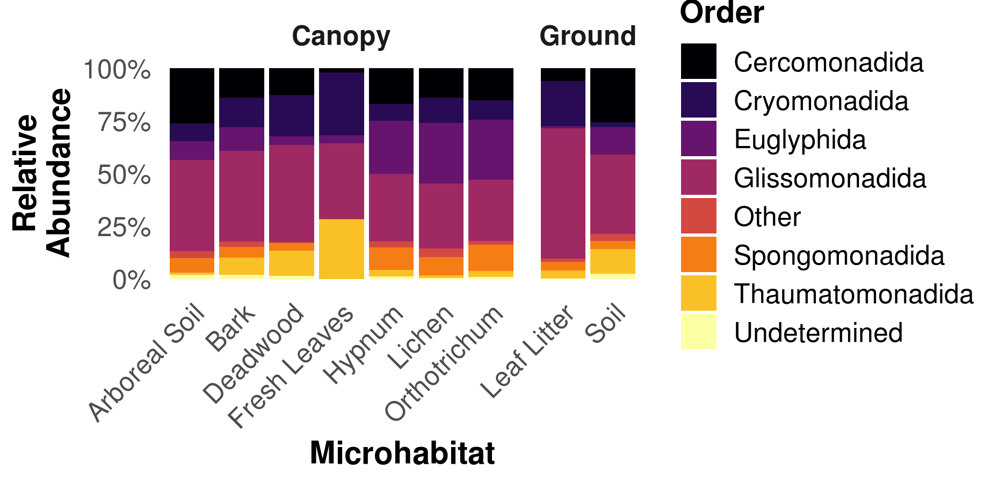
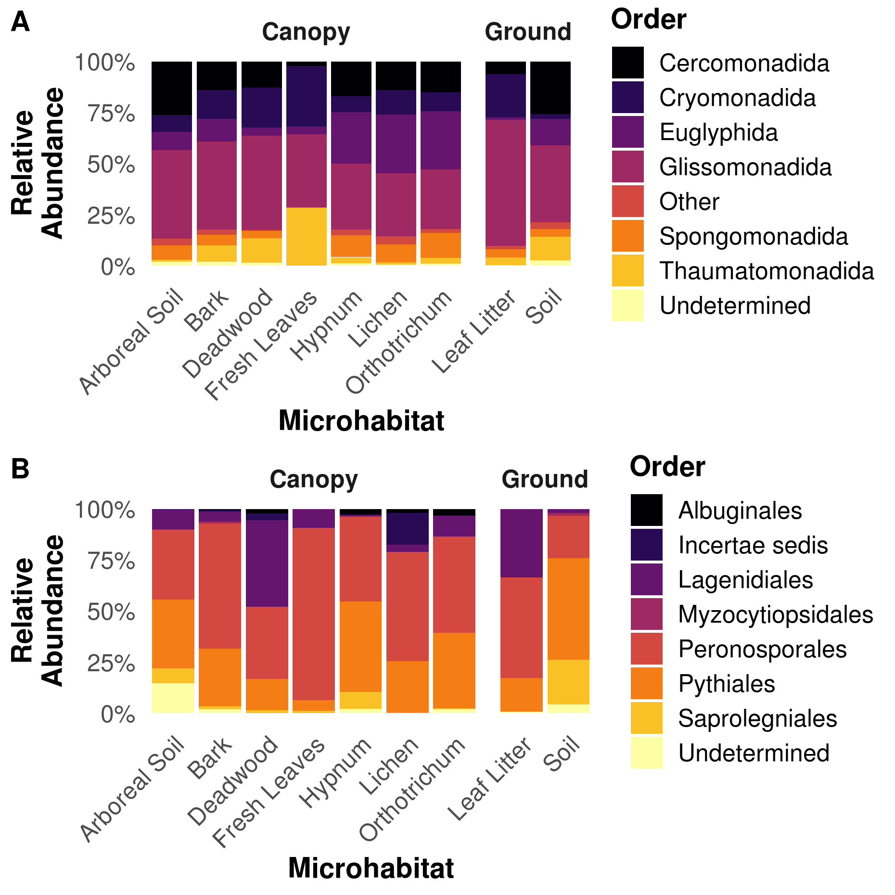
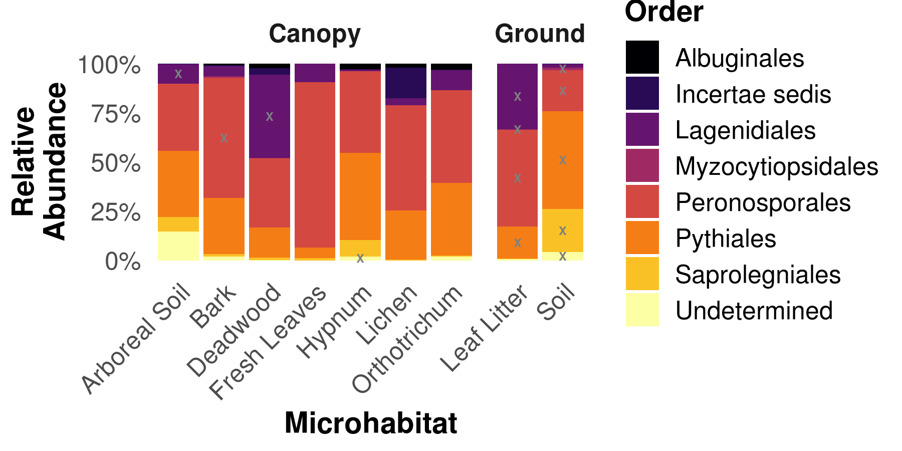
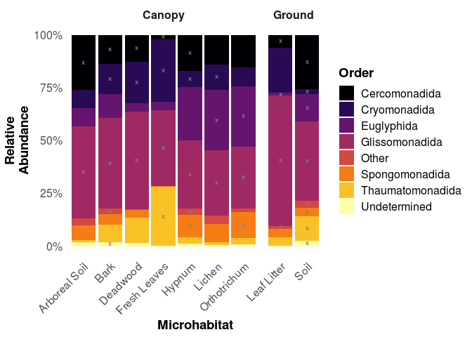

TaxonomyPerMicrohabitat
================

After plotting the total taxonomic composition, we now want to find out which groups (orders or families or genera) dominate which habitat. Here we will plot the taxonomic composition partitioned into the habitats in a stacked bar chart.

Prepare Data
------------

``` r
rm(list = ls())

library(ggplot2)
library(plyr)
library(ggpubr)
library(reshape2)
library(viridis)
library(indicspecies)

#setwd("02_Taxonomic_Annotation_and_Visualisation/")

TAX = read.csv("../00_Data/Oomycota/04_OwnSamples_OTU_ContingencyTable_filtered_sequences_NCBI-nt_blasted_sorted_BestHit-TaxonomyTable_Oomycetes_sequences_vsearch-ITS1-BestHit_AnnotationRefined_noPipe.tsv", 
                    header = F, 
                    sep = "\t", 
                    stringsAsFactors = T)
OTU_Table = as.data.frame(read.csv("../00_Data/Oomycota/05_OwnSamples_OTU_Table_min-freq-9588_transposed_withMetadata.tsv", 
                     header = T, 
                     sep = "\t", 
                     stringsAsFactors = T))

SampleMetadata = OTU_Table[,1:5]
OTU_Table = OTU_Table[,6:ncol(OTU_Table)]

Abundances = colSums(OTU_Table)
TAX = cbind(TAX, Abundances)

colnames(TAX) = c("OTU_Number", "Order", "Family", "Genus", "Species", "ReferenceID", "PercentID", "Abundance")
TAX$OTU_ID = paste0("OTU", TAX$OTU_Number, "_", TAX$Species)
TAX$Class = "Oomycota"
TAX$Order = gsub("Order_NoHit", "Undetermined", 
                           TAX$Order)
TAX$Order = gsub("incertae_sedis", "Incertae sedis", 
                           TAX$Order)

# remove orders represented by less than 1% of reads for sake of clarity
# It wont make much sense here because it only applies to the Myzocytiopsidales

# But later we do this for the Cercozoa
#TAX$OrderSubset = as.character(TAX$Order)
#OrderListOther = vector()
#for(Order in unique(TAX$Order)){
#  if(sum(TAX[TAX$Order == as.character(Order), #"Abundance"])/sum(TAX$Abundance)*100 < 1){
#    OrderListOther = c(OrderListOther, as.character(Order))
#  }
#}
#TAX$OrderSubset = as.factor(ifelse(TAX$OrderSubset %in%
#                                 OrderListOther,
#                               "Other", TAX$OrderSubset))
```

Aggregate Table
---------------

Next we aggregate the table by microhabitat and order. What we then have is a 9x8 dataframe with 9 microhabitats and 8 orders

``` r
OrderDataFunction = function(incidence){
OrderTable = OTU_Table
colnames(OrderTable) = TAX$Order

# First aggregate by Habitat
HabitatAggregatedOrderTable = 
  aggregate(OrderTable, 
            by = list(SampleMetadata$Microhabitat), 
            FUN = sum)
rownames(HabitatAggregatedOrderTable) = 
  HabitatAggregatedOrderTable$Group.1
HabitatAggregatedOrderTable = 
  HabitatAggregatedOrderTable[,-1]

# if you want to check the number of OTUs instead of the amount of reads:
# this is the point to convert it into a presence/absence matrix like this:
if(incidence == T){
HabitatAggregatedOrderTable[,] = 
  ifelse(HabitatAggregatedOrderTable[,] > 0, 1, 0)
}
#Then aggregate the (transposed) table by Order
HabitatAggregatedOrderTable = 
  aggregate(t(HabitatAggregatedOrderTable), 
            by = list(TAX$Order), 
            FUN = sum)
rownames(HabitatAggregatedOrderTable) = 
  HabitatAggregatedOrderTable$Group.1
HabitatAggregatedOrderTable = 
  HabitatAggregatedOrderTable[,-1]
HabitatAggregatedOrderTable = 
  as.data.frame(HabitatAggregatedOrderTable)

# melt the table so ggplot can interpret it as a histogram
data = HabitatAggregatedOrderTable
data$Order = rownames(data)
data2 = melt(data, id.vars = "Order")

# add the Stratum
data3 = data2
data3$Stratum = ifelse(grepl("Leaf Litter|^Soil", data2$variable), 
                       "Ground", "Canopy")

# for the plotting we need to change the column names
colnames(data3) = c("Order", "Microhabitat", "Abundance", "Stratum")

return(data3)
}
```

Plot stacked bar chart
----------------------

Now we plot it with `ggplot` and use the Stratum as a facet:

``` r
OrderData = OrderDataFunction(incidence = F)

g = ggplot(OrderData, aes(x = Microhabitat, y = Abundance, fill = Order)) + 
  geom_bar(position = position_fill(), stat = "identity") + 
  facet_grid(cols = vars(Stratum), scales = "free", space = "free") + 
  scale_y_continuous(labels = scales::comma) +
  labs(y = "Relative\nAbundance") + 
  scale_fill_viridis(discrete = T, option = "B") +
  theme_minimal() +
  theme(axis.text=element_text(size=12), 
        axis.text.x = element_text(angle = 45, hjust = 1), 
        axis.title=element_text(size=14, face = "bold"), 
        plot.title = element_text(size = 20, face = "bold", hjust = 0.5), 
        legend.text = element_text(size = 12), 
        legend.title = element_text(size = 14, face = "bold"), 
        strip.text = element_text(size=12, face = "bold"), 
        panel.grid = element_blank())

g
```


Cercozoa
--------

Repeat the steps for the Cercozoa:

``` r
TAX_cerco = read.csv("../00_Data/Cercozoa/04_Cercozoa_OwnSamples_OTU_ContingencyTable_filtered_sequences_NCBI-nt_blasted_sorted_BestHit-TaxonomyTable_Cercozoa_sequences_vsearch-V4-BestHit_AnnotationRefined_noPipe.tsv", 
                    header = F, 
                    sep = "\t", 
                    stringsAsFactors = T)
OTU_Table_cerco = as.data.frame(read.csv("../00_Data/Cercozoa/05_Cercozoa_OwnSamples_OTU_Table_min-freq-15684_transposed_withMetadata.tsv", 
                     header = T, 
                     sep = "\t", 
                     stringsAsFactors = T))

SampleMetadata_cerco = OTU_Table_cerco[,1:5]
OTU_Table_cerco = OTU_Table_cerco[,6:ncol(OTU_Table_cerco)]

Abundances = colSums(OTU_Table_cerco)
TAX_cerco = cbind(TAX_cerco, Abundances)

colnames(TAX_cerco) = c("OTU_Number", "Order", "Family", "Genus", "Species", "ReferenceID", "PercentID", "Abundance")
TAX_cerco$OTU_ID = paste0("OTU", TAX_cerco$OTU_Number, "_", TAX_cerco$Species)
TAX_cerco$Class = "Cercozoa"
TAX_cerco$Order = gsub("Order_NoHit", "Undetermined", 
                           TAX_cerco$Order)

# remove orders represented by less than 1% of reads for sake of clarity
TAX_cerco$OrderSubset = as.character(TAX_cerco$Order)
OrderListOther_cerco = vector()
for(Order in unique(TAX_cerco$Order)){
  if(sum(TAX_cerco[TAX_cerco$Order == as.character(Order), "Abundance"])/sum(TAX_cerco$Abundance)*100 < 1){
    OrderListOther_cerco = c(OrderListOther_cerco, as.character(Order))
  }
}
TAX_cerco$OrderSubset = as.factor(ifelse(TAX_cerco$OrderSubset %in%
                                 OrderListOther_cerco,
                               "Other", TAX_cerco$OrderSubset))


OrderDataFunction_cerco = function(incidence){
OrderTable = OTU_Table_cerco
colnames(OrderTable) = TAX_cerco$OrderSubset

# First aggregate by Habitat
HabitatAggregatedOrderTable = 
  aggregate(OrderTable, 
            by = list(SampleMetadata_cerco$Microhabitat), 
            FUN = sum)
rownames(HabitatAggregatedOrderTable) = 
  HabitatAggregatedOrderTable$Group.1
HabitatAggregatedOrderTable = 
  HabitatAggregatedOrderTable[,-1]

# if you want to check the number of OTUs instead of the amount of reads:
# this is the point to convert it into a presence/absence matrix like this:
if(incidence == T){
HabitatAggregatedOrderTable[,] = 
  ifelse(HabitatAggregatedOrderTable[,] > 0, 1, 0)
}
#Then aggregate the (transposed) table by Order
HabitatAggregatedOrderTable = 
  aggregate(t(HabitatAggregatedOrderTable), 
            by = list(TAX_cerco$OrderSubset), 
            FUN = sum)
rownames(HabitatAggregatedOrderTable) = 
  HabitatAggregatedOrderTable$Group.1
HabitatAggregatedOrderTable = 
  HabitatAggregatedOrderTable[,-1]
HabitatAggregatedOrderTable = 
  as.data.frame(HabitatAggregatedOrderTable)

# melt the table so ggplot can interpret it as a histogram
data = HabitatAggregatedOrderTable
data$Order = rownames(data)
data2 = melt(data, id.vars = "Order")

# add the Stratum
data3 = data2
data3$Stratum = ifelse(grepl("Leaf Litter|^Soil", data2$variable), 
                       "Ground", "Canopy")

# for the plotting we need to change the column names
colnames(data3) = c("Order", "Microhabitat", "Abundance", "Stratum")

return(data3)
}

OrderData_cerco = OrderDataFunction_cerco(incidence = F)

g_cerco = ggplot(OrderData_cerco, aes(x = Microhabitat, y = Abundance, fill = Order)) + 
  geom_bar(position = position_fill(), stat = "identity") + 
  facet_grid(cols = vars(Stratum), scales = "free", space = "free") + 
  scale_y_continuous(labels = scales::comma) +
  labs(y = "Relative\nAbundance") + 
  scale_fill_viridis(discrete = T, option = "B") +
  #scale_fill_brewer(type = "qual", palette = "Paired") + 
  theme_minimal() +
  theme(axis.text=element_text(size=12), 
        axis.text.x = element_text(angle = 45, hjust = 1), 
        axis.title=element_text(size=14, face = "bold"), 
        plot.title = element_text(size = 20, face = "bold", hjust = 0.5), 
        legend.text = element_text(size = 12), 
        legend.title = element_text(size = 14, face = "bold"), 
        strip.text = element_text(size=12, face = "bold"), 
        panel.grid = element_blank())

g_cerco
```



Combine Plots
-------------

``` r
combi = ggarrange(g_cerco, g, 
                  labels = c("A", "B"), 
                  ncol = 1, nrow = 2)

#ggsave("TaxonomicCompositionCombined.tif", plot = combi, 
#       device = "tiff", dpi = 600, width = 30, height = 37, 
#       units = "cm")
ggsave("TaxonomyPerMicrohabitatCombined.png", plot = combi, 
       device = "png", dpi = 300, width = 15, height = 15.5, 
       units = "cm")
ggsave("TaxonomyPerMicrohabitatCombined.jpeg", plot = combi, 
       device = "jpeg", dpi = 300, width = 15, height = 15.5, 
       units = "cm")
ggsave("TaxonomyPerMicrohabitatCombined.pdf", plot = combi, 
       device = "pdf", dpi = 300, width = 15, height = 15.5, 
       units = "cm")

combi
```



Indicator Species Analysis
--------------------------

Now we want to try an Indicative Value Analysis (IndVal) to determine taxa significantly indicate for a specific microhabitat. We mark the associated Order in the respecive Microhabitat with an "X" in the Barplot.

``` r
OTU_TableOrder = OTU_Table
colnames(OTU_TableOrder) = paste0(TAX$Order, "_", TAX$OTU_Number)

indvalOrder = multipatt(OTU_TableOrder, SampleMetadata$Microhabitat, 
                        duleg = T, control = how(nperm = 999))

indvalOrdersign = indvalOrder$sign[indvalOrder$sign$p.value <= 0.05 ,1:9]
colnames(indvalOrdersign) = gsub(pattern = "^s.", replacement = "", 
                                 x = colnames(indvalOrdersign))
RownamesOrder = gsub(pattern = "_[0-9]*$", replacement = "", 
                                 x = rownames(indvalOrdersign))

indvalOrdersign_aggregated = aggregate(x = indvalOrdersign, 
                                       by = list(RownamesOrder), 
                                       FUN = sum)

## If we are lacking some Orders, manually add them with 0
for(Order in unique(TAX$Order)){
  if(!(as.character(Order) %in% indvalOrdersign_aggregated$Group.1)){
    indvalOrdersign_aggregated = rbind(c(as.character(Order), rep(0, 9)), 
                                       indvalOrdersign_aggregated)
    indvalOrdersign_aggregated = indvalOrdersign_aggregated[order(indvalOrdersign_aggregated$Group.1),]
  }
}

indvalOrdersign_aggregated_melted = melt(indvalOrdersign_aggregated, 
                                         id.vars = "Group.1")
indvalOrdersign_aggregated_melted$value = ifelse(indvalOrdersign_aggregated_melted$value > 0, "X", NA_character_)

colnames(indvalOrdersign_aggregated_melted) = c("Order", "Microhabitat", "IndicatorSpecies")

OrderData = cbind(OrderData, indvalOrdersign_aggregated_melted$IndicatorSpecies)
colnames(OrderData) = c("Order", "Microhabitat", "Abundance", "Stratum", 
                        "IndicatorSpecies")


g_Ind = ggplot(OrderData, aes(x = Microhabitat, y = Abundance, fill = Order)) + 
  geom_bar(position = position_fill(), stat = "identity") + 
  facet_grid(cols = vars(Stratum), scales = "free", space = "free") + 
  geom_text(aes(label = IndicatorSpecies), stat = "identity", 
            position = position_fill(vjust = 0.5), 
            size = 2, color = "grey50", fontface = "bold") +
  scale_y_continuous(labels = scales::comma) +
  labs(y = "Relative\nAbundance") + 
  scale_fill_viridis(discrete = T, option = "B") +
  theme_minimal() +
  theme(axis.text=element_text(size=12), 
        axis.text.x = element_text(angle = 45, hjust = 1), 
        axis.title=element_text(size=14, face = "bold"), 
        plot.title = element_text(size = 20, face = "bold", hjust = 0.5), 
        legend.text = element_text(size = 12), 
        legend.title = element_text(size = 14, face = "bold"), 
        strip.text = element_text(size=12, face = "bold"), 
        panel.grid = element_blank())

g_Ind
```

    ## Warning: Removed 60 rows containing missing values (geom_text).



Cercozoa Indicator Analysis
---------------------------

``` r
OTU_TableOrder_cerco = OTU_Table_cerco
colnames(OTU_TableOrder_cerco) = paste0(TAX_cerco$OrderSubset, "_", TAX_cerco$OTU_Number)

indvalOrder_cerco = multipatt(OTU_TableOrder_cerco, SampleMetadata_cerco$Microhabitat, 
                        duleg = T, control = how(nperm = 999))

indvalOrdersign_cerco = indvalOrder_cerco$sign[indvalOrder_cerco$sign$p.value <= 0.05 ,1:9]
colnames(indvalOrdersign_cerco) = gsub(pattern = "^s.", replacement = "", 
                                 x = colnames(indvalOrdersign_cerco))
RownamesOrder_cerco = gsub(pattern = "_[0-9]*$", replacement = "", 
                                 x = rownames(indvalOrdersign_cerco))

indvalOrdersign_aggregated_cerco = aggregate(x = indvalOrdersign_cerco, 
                                       by = list(RownamesOrder_cerco), 
                                       FUN = sum)

## If we are lacking some Orders, manually add them with 0
for(Order in unique(TAX_cerco$OrderSubset)){
  if(!(as.character(Order) %in% indvalOrdersign_aggregated_cerco$Group.1)){
    indvalOrdersign_aggregated_cerco = rbind(c(as.character(Order), rep(0, 9)), 
                                       indvalOrdersign_aggregated_cerco)
    indvalOrdersign_aggregated_cerco = indvalOrdersign_aggregated_cerco[order(indvalOrdersign_aggregated_cerco$Group.1),]
  }
}

indvalOrdersign_aggregated_melted_cerco = melt(indvalOrdersign_aggregated_cerco, 
                                         id.vars = "Group.1")
indvalOrdersign_aggregated_melted_cerco$value = ifelse(indvalOrdersign_aggregated_melted_cerco$value > 0, "X", NA_character_)

colnames(indvalOrdersign_aggregated_melted_cerco) = c("Order", "Microhabitat", "IndicatorSpecies")

OrderData_cerco = cbind(OrderData_cerco, indvalOrdersign_aggregated_melted_cerco$IndicatorSpecies)
colnames(OrderData_cerco) = c("Order", "Microhabitat", "Abundance", "Stratum", 
                        "IndicatorSpecies")


g_cerco_Ind = ggplot(OrderData_cerco, aes(x = Microhabitat, y = Abundance, fill = Order)) + 
  geom_bar(position = position_fill(), stat = "identity") + 
  facet_grid(cols = vars(Stratum), scales = "free", space = "free") + 
  geom_text(aes(label = IndicatorSpecies), stat = "identity", 
            position = position_fill(vjust = 0.5), 
            size = 2, color = "grey50", fontface = "bold") +
  scale_y_continuous(labels = scales::comma) +
  labs(y = "Relative\nAbundance") + 
  scale_fill_viridis(discrete = T, option = "B") +
  theme_minimal() +
  theme(axis.text=element_text(size=12), 
        axis.text.x = element_text(angle = 45, hjust = 1), 
        axis.title=element_text(size=14, face = "bold"), 
        plot.title = element_text(size = 20, face = "bold", hjust = 0.5), 
        legend.text = element_text(size = 12), 
        legend.title = element_text(size = 14, face = "bold"), 
        strip.text = element_text(size=12, face = "bold"), 
        panel.grid = element_blank())

g_Ind
```

    ## Warning: Removed 60 rows containing missing values (geom_text).



Combine Indicator Analysis
--------------------------

``` r
combi = ggarrange(g_cerco_Ind, g_Ind, 
                  labels = c("A", "B"), 
                  ncol = 1, nrow = 2)

#ggsave("TaxonomicCompositionCombined.tif", plot = combi, 
#       device = "tiff", dpi = 600, width = 30, height = 37, 
#       units = "cm")
ggsave("TaxonomyPerMicrohabitatCombined_withIndicator.png", plot = combi, 
       device = "png", dpi = 300, width = 15, height = 15.5, 
       units = "cm")
ggsave("TaxonomyPerMicrohabitatCombined_withIndicator.jpeg", plot = combi, 
       device = "jpeg", dpi = 300, width = 15, height = 15.5, 
       units = "cm")
ggsave("TaxonomyPerMicrohabitatCombined_withIndicator.pdf", plot = combi, 
       device = "pdf", dpi = 300, width = 15, height = 15.5, 
       units = "cm")

combi
```


