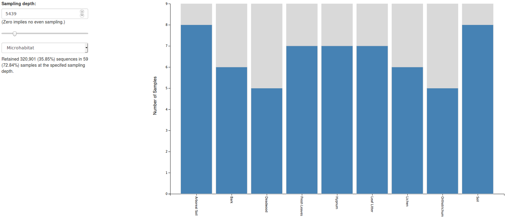
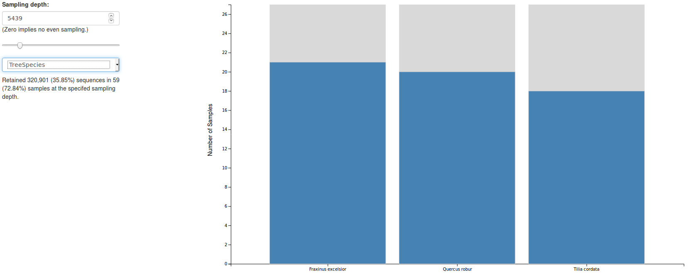

## Converting the OTU table

Unfortunately we cannot import a .tsv file into qiime. Thus we need to convert the table into the .biom format first. You can download the [biom tools package](http://biom-format.org/), this allows you to simply handle biom files. They also have an excellent documentation on their website.

Here is how I converted the OTU table (the plain read-count table, not the contingency table containing metadata!)

```sh
biom convert \
	-i 04_Autumn_2018_OTU_Table.tsv \
	-o 04_Autumn_2018_OTU_Table.json.biom \
	--table-type "OTU table" \
	--to-json
```

## Starting Qiime

Qiime requires a specific environment, this can be activated via

```sh
source activate qiime2-2018.11
```

That of course depends on the version you installed. Now we need to import the .biom table into a qiime2 artifact:

## Import the OTU Table

```sh
qiime tools import \
	--input-path 04_Autumn_2018_OTU_Table.json.biom \
	--input-format BIOMV100Format \
	--type FeatureTable[Frequency] \
	--output-path 04_Autumn_2018_OTU_Table.qza
```

`FeatureTable` refers to the OTU table, this might be a bit misleading at first, but you'll get used to calling an OTU a "feature". `Frequency` means that we are handling absolute count data, and not for example relative abundances. You can have a look at other table types and formats by typing

```sh
qiime tools import \
	--show-importable-types
	--show-importable-formats
```
To get an overview of the sampling depth and distribution of OTUs among the samples, we can summarize the table:

```sh
qiime feature-table summarize \
	--i-table 04_Autumn_2018_OTU_Table.json.biom \
	--m-sample-metadata-file 04_Autumn_2018_Sample_Metadata.csv \
	--o-visualization 04_Autumn_2018_OTU_Table.summary.qzv
	
qiime tools view \
	04_Autumn_2018_OTU_Table.summary.qzv
```

The .html file contains a lot of information, very interesting is the `Interactive Sample Detail`. You can concatenate the samples by e.g. Microhabitat and have a look at the sampling depth, which looks something like this:

	H18_K770_Laub	40,444
	H18_K455_Laub	28,777
	H18_K317_Laub	23,360
	H18_K439_Bor	22,681
	H18_K517_Laub	21,712
	...
	H18_K232_Laub	1,043
	H18_K517_Bor	929
	H18_K517_Fl	879
	H18_K317_Hyp	791
	H18_K733_Oth	578
	H18_K733_Bl.Fr	484
	H18_K733_Tot	73
	
## Subsample the Table

As you can see some samples are very well covered, some are not. To get rid of random effects resulting from low sampling depth, we can exclude some samples and filter by sampling depth. The interactive bar-chart shows how many samples and microhabitats would be excluded given a specific sampling depth, e.g. min. 5439 reads:





I decided to set the minimum sampling depth depending on how many samples from each microhabitat and tree species would be excluded. I set it as high as possible while retaining a minimum of **5 samples per microhabitat** and **15 samples per tree species** 

To subsample the table, simply type:

```sh
qiime feature-table filter-samples \
	--p-min-frequency 5439 \
	--i-table 04_Autumn_2018_OTU_Table.qza \
	--o-filtered-table 04_Autumn_2018_OTU_Table_min-freq-5439.qza
```

## Export Filtered Table

You can't directly export the filtered table to a tsv format, you have to use the biom format and then re-convert it to tsv like this:

```bash
qiime tools export \
        --input-path 04_Autumn_2018_OTU_Table_min-freq-5439.qza \
        --output-dir exported

biom convert \
        -i exported/feature-table.biom \
        -o 04_Autumn_2018_OTU_Table_min-freq-5439.tsv \
        --to-tsv
```