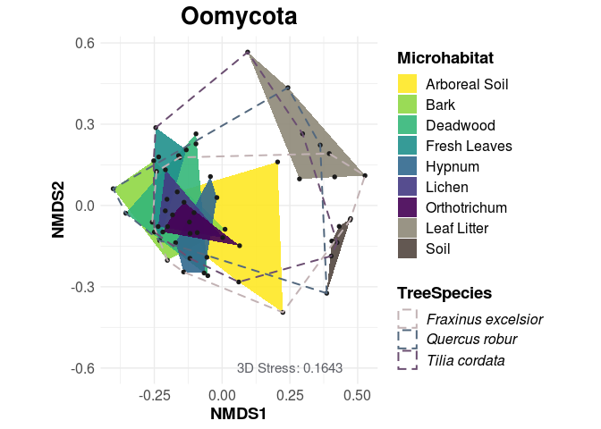
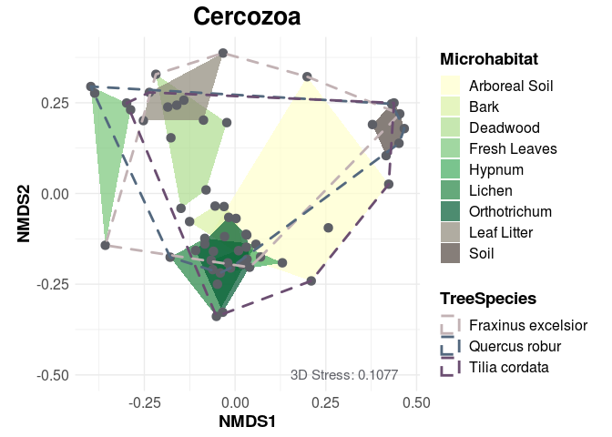

Nonmetric Multidimensional Scaling
================

**NMDS** is a method for visualising differences in community composition among samples, using distance matrices like the Bray-Curtis matrix. The idea is to visualise multiple dimensions (i.e. communities, samples, microhabitats, ...) in a 2-dimensional plot.

For more information, there is a fantastic tutorial by [Jon Lefcheck](https://jonlefcheck.net/2012/10/24/nmds-tutorial-in-r/), which guides you through the basics of an NMDS analysis in R.

Load Packages and OTU Table
---------------------------

``` r
rm(list = ls())

library(vegan)
library(ggplot2)
library(funrar)
library(ggpubr)
library(RColorBrewer)
library(viridis)

#setwd("05_Beta_Diversity/")

OTU_Table = read.csv("../00_Data/Oomycota/05_OwnSamples_OTU_Table_min-freq-9588_transposed_withMetadata.tsv", 
                     header=T, stringsAsFactors=TRUE, sep="\t")
species = OTU_Table[,6:ncol(OTU_Table)]
species_mat = as.matrix(species)
species_mat = make_relative(species_mat)
species_mat = log(species_mat +1)
SampleMetadata = as.data.frame(OTU_Table[,1:5])
```

Preparing the data
------------------

First, we need a distance matrix. We use the `vegdist` function, which by default builds the distance matrix based on the *Bray-Curtis-Distance*. This matrix is then parsed into the `metaMDS` function. The resulting object contains a lot of information, but we need to add the metadata information (like Microhabitat or Tree Species) for the plot. With that, we can group the points and connect them by metadata, to further visualise differences in our samples.

``` r
Dist = vegdist(species_mat, 
               diag = T, 
               na.rm = T)

OTU.NMDS.bray = metaMDS(Dist, # The distance matrix
                        k=3, # How many dimensions/axes to display 
                        trymax=100, # max number of iterations
                        wascores=TRUE, # Weighted species scores
                        trace=TRUE,
                        zerodist="add") # What to do with 0's after sqrt transformation

# Get the sample scores and add the metadata
data.scores = as.data.frame(scores(OTU.NMDS.bray))
data.scores$site = rownames(data.scores)
data.scores$Microhabitat = SampleMetadata$Microhabitat
data.scores$Stratum = SampleMetadata$Stratum
data.scores$TreeSpecies = SampleMetadata$TreeSpecies

# Group the samples by metadata (in this case, microhabitat and tree species)
Group.FreshLeaves = data.scores[data.scores$Microhabitat == "Fresh Leaves",][chull(data.scores[data.scores$Microhabitat == "Fresh Leaves", c("NMDS1", "NMDS2")]), ]
Group.Soil = data.scores[data.scores$Microhabitat == "Soil",][chull(data.scores[data.scores$Microhabitat == "Soil", c("NMDS1", "NMDS2")]), ]
Group.Bark = data.scores[data.scores$Microhabitat == "Bark",][chull(data.scores[data.scores$Microhabitat == "Bark", c("NMDS1", "NMDS2")]), ]
Group.ArborealSoil = data.scores[data.scores$Microhabitat == "Arboreal Soil",][chull(data.scores[data.scores$Microhabitat == "Arboreal Soil", c("NMDS1", "NMDS2")]), ]
Group.Lichen = data.scores[data.scores$Microhabitat == "Lichen",][chull(data.scores[data.scores$Microhabitat == "Lichen", c("NMDS1", "NMDS2")]), ]
Group.Hypnum = data.scores[data.scores$Microhabitat == "Hypnum",][chull(data.scores[data.scores$Microhabitat == "Hypnum", c("NMDS1", "NMDS2")]), ]
Group.LeafLitter = data.scores[data.scores$Microhabitat == "Leaf Litter",][chull(data.scores[data.scores$Microhabitat == "Leaf Litter", c("NMDS1", "NMDS2")]), ]
Group.Orthotrichum = data.scores[data.scores$Microhabitat == "Orthotrichum",][chull(data.scores[data.scores$Microhabitat == "Orthotrichum", c("NMDS1", "NMDS2")]), ]
Group.Deadwood = data.scores[data.scores$Microhabitat == "Deadwood",][chull(data.scores[data.scores$Microhabitat == "Deadwood", c("NMDS1", "NMDS2")]), ]

Group.Tilia = data.scores[data.scores$TreeSpecies == "Tilia cordata",][chull(data.scores[data.scores$TreeSpecies == "Tilia cordata", c("NMDS1", "NMDS2")]), ]
Group.Quercus = data.scores[data.scores$TreeSpecies == "Quercus robur",][chull(data.scores[data.scores$TreeSpecies == "Quercus robur", c("NMDS1", "NMDS2")]), ]
Group.Fraxinus = data.scores[data.scores$TreeSpecies == "Fraxinus excelsior",][chull(data.scores[data.scores$TreeSpecies == "Fraxinus excelsior", c("NMDS1", "NMDS2")]), ]

# The hull-data will be needed by ggplot later to draw the polygons
hull.data = rbind(Group.ArborealSoil, Group.Bark, Group.Deadwood, Group.FreshLeaves, Group.Hypnum, Group.LeafLitter, Group.Lichen, Group.Orthotrichum, Group.Soil)

hull.data_TreeSpecies = rbind(Group.Tilia, Group.Quercus, Group.Fraxinus)
```

Plot with ggplot2
-----------------

I personally do not like the default colours from `ggplot`. So here I use colours corresponding to the YlGn Palette from [ColorBrewer](http://colorbrewer2.org/#type=sequential&scheme=YlGn&n=7).

``` r
g = ggplot() + 
  geom_polygon(data = hull.data, 
               aes(x=NMDS1, y=NMDS2, group = Microhabitat, fill = Microhabitat), 
               alpha = 0.9) + 
  scale_fill_manual(limits = c("Arboreal Soil", "Bark", "Deadwood", 
                               "Fresh Leaves",  "Hypnum", "Lichen", 
                               "Orthotrichum", "Leaf Litter", "Soil"), 
                    values = c(viridis(7, direction = -1), 
                               "#8e8878", "#524640")) + 
  geom_point(data = data.scores, 
             aes(x = NMDS1, y = NMDS2), 
             size = 1.25,
             color = "grey10") + 
  geom_polygon(data = hull.data_TreeSpecies, 
               aes(x=NMDS1, y=NMDS2, group = TreeSpecies, color = TreeSpecies), 
               alpha = 0.7, fill = NA, linetype = "dashed", size = 0.7) +
  scale_color_manual(values = c("#c2b2b4", "#53687e", "#6b4e71"), 
                     labels = c(expression(italic("Fraxinus excelsior")), 
                                expression(italic("Quercus robur")), 
                                expression(italic("Tilia cordata")))) +
  geom_text(aes(x = 0.25, y = -0.6, label = as.character(paste0(OTU.NMDS.bray$ndim, "D Stress: ", round(as.numeric(OTU.NMDS.bray$stress), digits = 4)))), parse = F, color = "#5d5f66", size = 4) +
  coord_equal() + 
  theme_minimal() +
  labs(title = "Oomycota") +
  theme(axis.text=element_text(size=12), 
        axis.title=element_text(size=14, face = "bold"), 
        legend.text = element_text(size = 12), 
        legend.text.align = 0, 
        legend.title = element_text(size = 14, face = "bold"), 
        plot.title = element_text(size = 20, face = "bold", hjust = 0.5))

g
```



Interesting! We do not have any overlap between canopy- and ground-samples.
What's more, we even do not have an overlap between the two ground habitats, soil and leaf litter. The canopy samples form a huge "blob" with a lot of overlaps, similar as we have seen in the Clustermap. There are two samples from Arboreal Soil which are quite far from any other sample. This is also what we could observe in the clustermap.

The **Stress Value** of the NMDS Plot (0.165) is in a reliable range. As a rule of thumb:

-   stress ~ 0.05 is excellent
-   stress ~ 0.1 is very good
-   stress ~ 0.2 is ok
-   stress ~ 0.3 gives a poor resolution

High stress values mean that it's hard to collapse the information in our data into two or three dimensions, there still seems to be unexplained variance.

Nevertheless, the NMDS plot clearly indicates that **stratification** plays a more important role than **habitat filtering** in oomycete community composition.

We can check if the other dimensions (NMDS1 &lt;-&gt; NMDS3 and NMDS2 &lt;-&gt; NMDS3) also support this pattern. Sometimes, changing the perspective by rotating the plot gives a little bit different information. To do so, we need to manipulate the plot function and the grouping of the hull.data to specify the different NMDS axes, which is described here for NMDS1 &lt;-&gt; NMDS3 but was also applied for NMDS2 &lt;-&gt; NMDS3:

``` r
Group1_3.FreshLeaves = data.scores[data.scores$Microhabitat == "Fresh Leaves",][chull(data.scores[data.scores$Microhabitat == "Fresh Leaves", c("NMDS1", "NMDS3")]), ]
Group1_3.Soil = data.scores[data.scores$Microhabitat == "Soil",][chull(data.scores[data.scores$Microhabitat == "Soil", c("NMDS1", "NMDS3")]), ]
Group1_3.Bark = data.scores[data.scores$Microhabitat == "Bark",][chull(data.scores[data.scores$Microhabitat == "Bark", c("NMDS1", "NMDS3")]), ]
Group1_3.ArborealSoil = data.scores[data.scores$Microhabitat == "Arboreal Soil",][chull(data.scores[data.scores$Microhabitat == "Arboreal Soil", c("NMDS1", "NMDS3")]), ]
Group1_3.Lichen = data.scores[data.scores$Microhabitat == "Lichen",][chull(data.scores[data.scores$Microhabitat == "Lichen", c("NMDS1", "NMDS3")]), ]
Group1_3.Hypnum = data.scores[data.scores$Microhabitat == "Hypnum",][chull(data.scores[data.scores$Microhabitat == "Hypnum", c("NMDS1", "NMDS3")]), ]
Group1_3.LeafLitter = data.scores[data.scores$Microhabitat == "Leaf Litter",][chull(data.scores[data.scores$Microhabitat == "Leaf Litter", c("NMDS1", "NMDS3")]), ]
Group1_3.Orthotrichum = data.scores[data.scores$Microhabitat == "Orthotrichum",][chull(data.scores[data.scores$Microhabitat == "Orthotrichum", c("NMDS1", "NMDS3")]), ]
Group1_3.Deadwood = data.scores[data.scores$Microhabitat == "Deadwood",][chull(data.scores[data.scores$Microhabitat == "Deadwood", c("NMDS1", "NMDS3")]), ]

Group1_3.Tilia = data.scores[data.scores$TreeSpecies == "Tilia cordata",][chull(data.scores[data.scores$TreeSpecies == "Tilia cordata", c("NMDS1", "NMDS3")]), ]
Group1_3.Quercus = data.scores[data.scores$TreeSpecies == "Quercus robur",][chull(data.scores[data.scores$TreeSpecies == "Quercus robur", c("NMDS1", "NMDS3")]), ]
Group1_3.Fraxinus = data.scores[data.scores$TreeSpecies == "Fraxinus excelsior",][chull(data.scores[data.scores$TreeSpecies == "Fraxinus excelsior", c("NMDS1", "NMDS3")]), ]

# The hull-data will be needed by ggplot later to draw the polygons
hull.data1_3 = rbind(Group1_3.ArborealSoil, Group1_3.Bark, Group1_3.Deadwood, Group1_3.FreshLeaves, Group1_3.Hypnum, Group1_3.LeafLitter, Group1_3.Lichen, Group1_3.Orthotrichum, Group1_3.Soil)

hull.data1_3_TreeSpecies = rbind(Group1_3.Tilia, Group1_3.Quercus, Group1_3.Fraxinus)

ggplot() + 
  geom_polygon(data = hull.data1_3, 
               aes(x=NMDS1, y=NMDS3, group = Microhabitat, fill = Microhabitat), 
               alpha = 0.9) + 
  scale_fill_manual(values = c(viridis(7, direction = -1), 
                               "#8e8878", "#524640"), 
                    limits = c("Arboreal Soil", "Bark", "Deadwood", 
                               "Fresh Leaves",  "Hypnum", "Lichen", 
                               "Orthotrichum", "Leaf Litter", "Soil")) + 
  geom_point(data = data.scores, 
             aes(x = NMDS1, y = NMDS3), 
             size = 3,
             color = "#5d5f66") + 
  geom_polygon(data = hull.data1_3_TreeSpecies, 
               aes(x=NMDS1, y=NMDS3, group = TreeSpecies, color = TreeSpecies), 
               alpha = 0.7, fill = NA, linetype = "dashed", size = 1) +
  scale_color_manual(values = c("#c2b2b4", "#53687e", "#6b4e71")) +
  geom_text(aes(x = 0.35, y = -0.5, label = as.character(paste0(OTU.NMDS.bray$ndim, "D Stress: ", round(as.numeric(OTU.NMDS.bray$stress), digits = 4)))), parse = F, color = "#5d5f66", size = 4) +
  coord_equal() + 
  theme_minimal() +
  labs(title = "Oomycota") +
  theme(axis.text=element_text(size=12), 
        axis.title=element_text(size=14, face = "bold"), 
        legend.text = element_text(size = 12), 
        legend.title = element_text(size = 14, face = "bold"), 
        plot.title = element_text(size = 20, face = "bold", hjust = 0.5))
```


Plotting NMDS1 &lt;--&gt; NMDS3 yields nearly the same pattern, while NMDS2 &lt;--&gt; NMDS3 shows a huge overlap between all samples. This might well be, but don't forget that NMDS2 and NMDS3 are the two axes explaining less variance than NMDS1. Same is true for a Principal Component analysis.

Interpreting the other dimensions can be tricky, so don't tend to overestimate the plots. NMDS is an unconstrained analysis, it might be a good idea to compare the results with a different, constrained approach, like a redundancy analysis descibed in the next chapter. But first, let's do the Cercozoa:

Cercozoa
========

``` r
OTU_Table_cerco = read.csv("../00_Data/Cercozoa/05_Cercozoa_OwnSamples_OTU_Table_min-freq-15684_transposed_withMetadata.tsv", 
                     header=T, stringsAsFactors=TRUE, sep="\t")
species_cerco = OTU_Table_cerco[,6:ncol(OTU_Table_cerco)]
species_mat_cerco = as.matrix(species_cerco)
species_mat_cerco = make_relative(species_mat_cerco)
species_mat_cerco = log(species_mat_cerco +1)
SampleMetadata_cerco = as.data.frame(OTU_Table_cerco[,1:5])

Dist_cerco = vegdist(species_mat_cerco, 
               diag = T, 
               na.rm = T)

OTU.NMDS.bray_cerco = metaMDS(Dist_cerco, # The distance matrix
                        k=3, # How many dimensions/axes to display 
                        trymax=100, # max number of iterations
                        wascores=TRUE, # Weighted species scores
                        trace=TRUE,
                        zerodist="add") # What to do with 0's after sqrt transformation
```

    ## Run 0 stress 0.1079607 
    ## Run 1 stress 0.1159872 
    ## Run 2 stress 0.1145437 
    ## Run 3 stress 0.1135064 
    ## Run 4 stress 0.1173196 
    ## Run 5 stress 0.1127145 
    ## Run 6 stress 0.1076603 
    ## ... New best solution
    ## ... Procrustes: rmse 0.02084431  max resid 0.1482931 
    ## Run 7 stress 0.1151048 
    ## Run 8 stress 0.1179667 
    ## Run 9 stress 0.1121893 
    ## Run 10 stress 0.117651 
    ## Run 11 stress 0.1152956 
    ## Run 12 stress 0.1183538 
    ## Run 13 stress 0.1151118 
    ## Run 14 stress 0.1130372 
    ## Run 15 stress 0.1151008 
    ## Run 16 stress 0.1077948 
    ## ... Procrustes: rmse 0.004534323  max resid 0.0285156 
    ## Run 17 stress 0.115296 
    ## Run 18 stress 0.1176219 
    ## Run 19 stress 0.1135707 
    ## Run 20 stress 0.1146335 
    ## Run 21 stress 0.113368 
    ## Run 22 stress 0.1109157 
    ## Run 23 stress 0.1106284 
    ## Run 24 stress 0.1076594 
    ## ... New best solution
    ## ... Procrustes: rmse 0.0003273751  max resid 0.001638141 
    ## ... Similar to previous best
    ## *** Solution reached

``` r
# Get the sample scores and add the metadata
data.scores_cerco = as.data.frame(scores(OTU.NMDS.bray_cerco))
data.scores_cerco$site = rownames(data.scores_cerco)
data.scores_cerco$Microhabitat = SampleMetadata_cerco$Microhabitat
data.scores_cerco$Stratum = SampleMetadata_cerco$Stratum
data.scores_cerco$TreeSpecies = SampleMetadata_cerco$TreeSpecies

# Group the samples by metadata (in this case, microhabitat and tree species)
Group_cerco.FreshLeaves = data.scores_cerco[data.scores_cerco$Microhabitat == "Fresh Leaves",][chull(data.scores_cerco[data.scores_cerco$Microhabitat == "Fresh Leaves", c("NMDS1", "NMDS2")]), ]
Group_cerco.Soil = data.scores_cerco[data.scores_cerco$Microhabitat == "Soil",][chull(data.scores_cerco[data.scores_cerco$Microhabitat == "Soil", c("NMDS1", "NMDS2")]), ]
Group_cerco.Bark = data.scores_cerco[data.scores_cerco$Microhabitat == "Bark",][chull(data.scores_cerco[data.scores_cerco$Microhabitat == "Bark", c("NMDS1", "NMDS2")]), ]
Group_cerco.ArborealSoil = data.scores_cerco[data.scores_cerco$Microhabitat == "Arboreal Soil",][chull(data.scores_cerco[data.scores_cerco$Microhabitat == "Arboreal Soil", c("NMDS1", "NMDS2")]), ]
Group_cerco.Lichen = data.scores_cerco[data.scores_cerco$Microhabitat == "Lichen",][chull(data.scores_cerco[data.scores_cerco$Microhabitat == "Lichen", c("NMDS1", "NMDS2")]), ]
Group_cerco.Hypnum = data.scores_cerco[data.scores_cerco$Microhabitat == "Hypnum",][chull(data.scores_cerco[data.scores_cerco$Microhabitat == "Hypnum", c("NMDS1", "NMDS2")]), ]
Group_cerco.LeafLitter = data.scores_cerco[data.scores_cerco$Microhabitat == "Leaf Litter",][chull(data.scores_cerco[data.scores_cerco$Microhabitat == "Leaf Litter", c("NMDS1", "NMDS2")]), ]
Group_cerco.Orthotrichum = data.scores_cerco[data.scores_cerco$Microhabitat == "Orthotrichum",][chull(data.scores_cerco[data.scores_cerco$Microhabitat == "Orthotrichum", c("NMDS1", "NMDS2")]), ]
Group_cerco.Deadwood = data.scores_cerco[data.scores_cerco$Microhabitat == "Deadwood",][chull(data.scores_cerco[data.scores_cerco$Microhabitat == "Deadwood", c("NMDS1", "NMDS2")]), ]

Group_cerco.Tilia = data.scores_cerco[data.scores_cerco$TreeSpecies == "Tilia cordata",][chull(data.scores_cerco[data.scores_cerco$TreeSpecies == "Tilia cordata", c("NMDS1", "NMDS2")]), ]
Group_cerco.Quercus = data.scores_cerco[data.scores_cerco$TreeSpecies == "Quercus robur",][chull(data.scores_cerco[data.scores_cerco$TreeSpecies == "Quercus robur", c("NMDS1", "NMDS2")]), ]
Group_cerco.Fraxinus = data.scores_cerco[data.scores_cerco$TreeSpecies == "Fraxinus excelsior",][chull(data.scores_cerco[data.scores_cerco$TreeSpecies == "Fraxinus excelsior", c("NMDS1", "NMDS2")]), ]

# The hull-data will be needed by ggplot later to draw the polygons
hull.data_cerco = rbind(Group_cerco.ArborealSoil, Group_cerco.Bark, Group_cerco.Deadwood, Group_cerco.FreshLeaves, Group_cerco.Hypnum, Group_cerco.LeafLitter, Group_cerco.Lichen, Group_cerco.Orthotrichum, Group_cerco.Soil)

hull.data_TreeSpecies_cerco = rbind(Group_cerco.Tilia, Group_cerco.Quercus, Group_cerco.Fraxinus)

g_cerco = ggplot() + 
  geom_polygon(data = hull.data_cerco, 
               aes(x=NMDS1, y=NMDS2, group = Microhabitat, fill = Microhabitat), 
               alpha = 0.9) + 
  scale_fill_manual(limits = c("Arboreal Soil", "Bark", "Deadwood", 
                               "Fresh Leaves",  "Hypnum", "Lichen", 
                               "Orthotrichum", "Leaf Litter", "Soil"), 
                    values = c(viridis(7, direction = -1), 
                               "#8e8878", "#524640")) + 
  geom_point(data = data.scores_cerco, 
             aes(x = NMDS1, y = NMDS2), 
             size = 1.25,
             color = "grey10") + 
  geom_polygon(data = hull.data_TreeSpecies_cerco, 
               aes(x=NMDS1, y=NMDS2, group = TreeSpecies, color = TreeSpecies), 
               alpha = 0.7, fill = NA, linetype = "dashed", size = 0.7) +
  scale_color_manual(values = c("#c2b2b4", "#53687e", "#6b4e71"), 
                     labels = c(expression(italic("Fraxinus excelsior")), 
                                expression(italic("Quercus robur")), 
                                expression(italic("Tilia cordata")))) +
  geom_text(aes(x = 0.2, y = -0.4, label = as.character(paste0(OTU.NMDS.bray_cerco$ndim, "D Stress: ", round(as.numeric(OTU.NMDS.bray_cerco$stress), digits = 4)))), parse = F, color = "#5d5f66", size = 4) +
  coord_equal() + 
  theme_minimal() +
  labs(title = "Cercozoa") +
  theme(axis.text=element_text(size=12), 
        axis.title=element_text(size=14, face = "bold"), 
        legend.text = element_text(size = 12), 
        legend.text.align = 0,
        legend.title = element_text(size = 14, face = "bold"), 
        plot.title = element_text(size = 20, face = "bold", hjust = 0.5))

g_cerco
```



Combine Plots
-------------

``` r
g$labels$title = NULL
g_cerco$labels$title = NULL

combi = ggarrange(g_cerco, g, 
                  labels = c("A", "B"), 
                  ncol = 2, nrow = 1, 
                  common.legend = T, legend = "right", 
                  align = "h", vjust = 1.5) #%>%
  #annotate_figure(fig.lab = "Figure X", fig.lab.face = "bold", 
  #                fig.lab.size = 18, 
  #                top = text_grob("Non-metric multidimensional scaling", 
  #                                face = "bold", size = 20))

#ggsave("NMDSCombined.tif", plot = combi, 
#       device = "tiff", dpi = 600, width = 28, height = 11, 
#       units = "cm")
ggsave("NMDSCombined.png", plot = combi, 
       device = "png", dpi = 300, width = 20, height = 10, 
       units = "cm")
ggsave("NMDSCombined.jpeg", plot = combi, 
       device = "jpeg", dpi = 300, width = 20, height = 10, 
       units = "cm")
ggsave("NMDSCombined.pdf", plot = combi, 
       device = "pdf", dpi = 300, width = 20, height = 10, 
       units = "cm")
```
