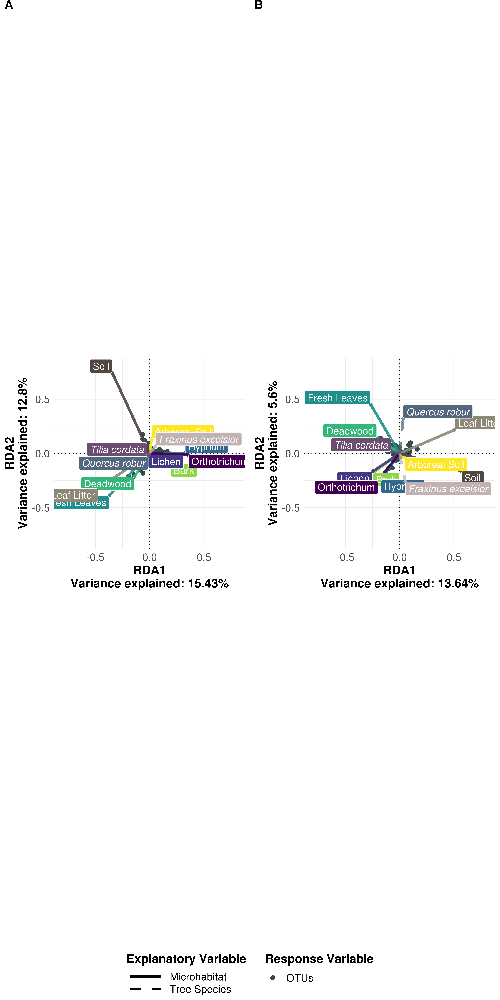

Redundancy Analysis
================

In the method before (NMDS), we performed an unconstrained analysis. Let's check if the pattern remains similar when performing a constrained analysis, in this case: Redundancy Analysis (RDA).

In a constrained analysis, we test the influence of explanatory variables -- which are here the microhabitats and tree species -- on response variables (our OTU abundances). The principle is similar to a PCA, but the idea is to regress the PCA scores on the environmental variables.

Load Data
---------

First, load the data and define the variables:

``` r
rm(list = ls())

library(ggplot2)
library(vegan)
library(RColorBrewer)
library(funrar)
library(ggpubr)
library(viridis)

#setwd("05_Beta_Diversity/")

OTU_Table = as.data.frame(read.csv("../00_Data/Oomycota/05_OwnSamples_OTU_Table_min-freq-9588_transposed_withMetadata.tsv", 
                     header = T, 
                     sep = "\t", 
                     stringsAsFactors = T))

SampleMetadata = OTU_Table[,1:5]
rownames(OTU_Table) = SampleMetadata$SampleID
rownames(SampleMetadata) = SampleMetadata$SampleID
species = OTU_Table[,6:ncol(OTU_Table)]
species_mat = as.matrix(species)
species_mat = make_relative(species_mat)

Microhabitat = SampleMetadata$Microhabitat
TreeSpecies = SampleMetadata$TreeSpecies
```

Perform RDA
-----------

Next we normalise our species matrix with a hellinger transformation and perform the redundancy analysis. We want to test both the microhabitats as well as the tree species as an explanatory variable:

``` r
species_mat_he = decostand(species_mat, "hellinger")
species_mat_rda = rda(species_mat_he~Microhabitat+TreeSpecies)
summary_species_mat_rda = summary(species_mat_rda, scaling = 2)
```

In an RDA, you can define two types of `scaling`:

-   `scaling = 1` gives a distance plot, where euclidean distances are given by the position of the objects.
-   `scaling = 2` represents a linear correlation between the vectors. This means, two vectors with an angle of 90° are not correlated, while vectors pointing into the same direction are highly correlated. This is what we want to see here, so we set scaling to 2.

Create Dataframes
-----------------

From the RDA-summary object, we need to extract three dataframes:

1.  The positions for the microhabitat vectors
2.  The positions fot the OTUs
3.  The positions for the tree species vectors

``` r
# For the microhabitats (rows 1-9)
df1  <- data.frame(summary_species_mat_rda$centroids[1:9,1:2])
rownames(df1) = gsub("Microhabitat", "", rownames(df1))
df1$Microhabitat = rownames(df1)

# For the species (OTUs)
df2  <- data.frame(summary_species_mat_rda$species[,1:2])

# For the tree species (rows 10-12)
df3 = data.frame(summary_species_mat_rda$centroids[10:12,1:2])
rownames(df3) = gsub("TreeSpecies", "", rownames(df3))
df3$TreeSpecies = rownames(df3)
```

Plot RDA
--------

Now let's plot the results using the three dataframes. Some of the labels overlap, so I manually adjust the hjust with 0 (label right) or 1 (label left). From the summary we can also extract information about the proportion of explained variance in the axes, which will be added to the axes labels.

``` r
g = ggplot(df2, aes(x=RDA1, y=RDA2)) + 
  geom_point(aes(fill = "OTUs"), size=2, color = "darkslategrey") +
  geom_hline(yintercept=0, linetype="dotted") +
  geom_vline(xintercept=0, linetype="dotted") +
  geom_segment(data=df1, aes(x=0, xend=RDA1, y=0, yend=RDA2, 
                             linetype = "Microhabitat", color = Microhabitat), 
               arrow=arrow(length=unit(0.01,"npc")), 
               size = 1.5, alpha = 0.9) +
  scale_color_manual(values = c(viridis(7, direction = -1), 
                               "#8e8878", "#524640"), 
                     limits = c("Arboreal Soil", "Bark", "Deadwood", 
                                "Fresh Leaves", "Hypnum", "Lichen", 
                                "Orthotrichum", "Leaf Litter", "Soil")) +
  geom_label(data=df1, 
             aes(x=RDA1,y=RDA2,label=Microhabitat,
                 fill = Microhabitat,
                 hjust=c(0,0,1,1,0,0,1,1,0), 
                 #hjust=0.5*(1-sign(RDA1)),
                 vjust=0.5*(1-sign(RDA2))), 
             color = "white", size=4, 
             fill = c(viridis(7, direction = -1)[1:5], 
                      "#8e8878", 
                      viridis(7, direction = -1)[6:7], 
                      "#524640")) + 
  geom_segment(data=df3, aes(x=0, xend=RDA1, y=0, yend=RDA2, 
                             linetype = "Tree Species", color = TreeSpecies), 
               arrow=arrow(length=unit(0.01,"npc")), 
               size = 1.5, alpha = 0.75, 
               color = c("#c2b2b4", "#53687e", "#6b4e71")) +
  geom_label(data=df3, 
            aes(x=RDA1,y=RDA2,label=rownames(df3),
                hjust=0.5*(1-sign(RDA1)),
                vjust=0.5*(1-sign(RDA2))), 
            fill= c("#c2b2b4", "#53687e", "#6b4e71"), 
            color = "white", size=4, fontface = "italic") + 
  scale_x_continuous(limits = c(-0.8, 0.8)) + 
  scale_y_continuous(limits = c(-0.8, 0.8)) +
  labs(title = "Redundancy Analysis - Oomycota", 
       x = paste0("RDA1\nVariance explained: ",
                  round(as.numeric(summary_species_mat_rda$cont$importance["Proportion Explained", "RDA1"]), digits = 4) * 100, 
                  "%"), 
       y = paste0("RDA2\nVariance explained: ",
                  round(as.numeric(summary_species_mat_rda$cont$importance["Proportion Explained", "RDA2"]), digits = 4) * 100, 
                  "%")) +
  theme_minimal() + 
  theme(legend.text = element_text(size = 12), 
        legend.title = element_text(size = 14, face = "bold"), 
        legend.position = "right",
        legend.direction = "vertical", 
        plot.title = element_text(size = 18, face = "bold", hjust = 0.5, vjust = 0.5), 
        legend.title.align = 0.5,
        axis.title = element_text(size = 14, face = "bold"), 
        axis.text = element_text(size = 12)) +
  scale_linetype_manual(name = "Explanatory Variable", 
                        values = c("Microhabitat"=1, "Tree Species"=2)) + 
  scale_fill_manual(name = "Response Variable", 
                    values = "darkslategrey") +
  guides(color = F, 
         linetype=guide_legend(keywidth = 3, keyheight = 1, order = 1), 
         fill = guide_legend(order = 2)) + 
  coord_equal()

g
```


Again, we see a similar pattern as in the NMDS Plot: The two ground habitats are quite far apart from the canopy samples and do not show an overlap. But now, the canopy samples are distributed on a broader scale:

The bark samples form a cluster together with the epiphytes (moss and lichen), which kind of makes sense. The fresh leaves are far from the other samples, but now more closely clustered with the deadwood samples.

Interestingly, all three tree species point to different directions, which means every species has a different explanatory power. This is different from the NMDS plot earlier.

Yet, the percentage of explained variance is quite low. Results should be interpreted with caution. Nevertheless, some microhabitats have a strong explanatory power, especially the ground habitats and fresh leaves. Microhabitat heterogenity does seem to have an impact on oomycete community composition to a greater extant than shown by the NMDS plot.

Cercozoa
========

Now we run the same script on the ceroczoan dataset:

``` r
OTU_Table_cerco = as.data.frame(read.csv("../00_Data/Cercozoa/05_Cercozoa_OwnSamples_OTU_Table_min-freq-15684_transposed_withMetadata.tsv", 
                     header = T, 
                     sep = "\t", 
                     stringsAsFactors = T))

SampleMetadata_cerco = OTU_Table_cerco[,1:5]
rownames(OTU_Table_cerco) = SampleMetadata_cerco$SampleID
rownames(SampleMetadata_cerco) = SampleMetadata_cerco$SampleID
species_cerco = OTU_Table_cerco[,6:ncol(OTU_Table_cerco)]
species_mat_cerco = as.matrix(species_cerco)
species_mat_cerco = make_relative(species_mat_cerco)

Microhabitat_cerco = SampleMetadata_cerco$Microhabitat
TreeSpecies_cerco = SampleMetadata_cerco$TreeSpecies

species_mat_he_cerco = decostand(species_mat_cerco, "hellinger")
species_mat_rda_cerco = rda(species_mat_he_cerco~Microhabitat_cerco+TreeSpecies_cerco)
summary_species_mat_rda_cerco = summary(species_mat_rda_cerco)

df1_cerco <- data.frame(summary_species_mat_rda_cerco$centroids[1:9,1:2])       # RDA1 and RDA2
rownames(df1_cerco) = gsub("Microhabitat_cerco", "", rownames(df1_cerco))
df1_cerco$Microhabitat = rownames(df1_cerco)
df2_cerco <- data.frame(summary_species_mat_rda_cerco$species[,1:2])     # loadings for RDA1 and RDA2
df3_cerco = data.frame(summary_species_mat_rda_cerco$centroids[10:12,1:2])
rownames(df3_cerco) = gsub("TreeSpecies_cerco", "", rownames(df3_cerco))
df3_cerco$TreeSpecies = rownames(df3_cerco)


g_cerco = ggplot(df2_cerco, aes(x=RDA1, y=RDA2)) + 
  geom_point(aes(fill = "OTUs"), size=2, color = "darkslategrey") +
  geom_hline(yintercept=0, linetype="dotted") +
  geom_vline(xintercept=0, linetype="dotted") +
  geom_segment(data=df1_cerco, aes(x=0, xend=RDA1, y=0, yend=RDA2, 
                             linetype = "Microhabitat", color = Microhabitat), 
               arrow=arrow(length=unit(0.01,"npc")), 
               size = 1.5, alpha = 0.9) +
  scale_color_manual(values = c(viridis(7, direction = -1), 
                               "#8e8878", "#524640"), 
                     limits = c("Arboreal Soil", "Bark", "Deadwood", 
                                "Fresh Leaves", "Hypnum", "Lichen", 
                                "Orthotrichum", "Leaf Litter", "Soil")) +
  geom_label(data=df1_cerco, 
             aes(x=RDA1,y=RDA2,label=Microhabitat,
                 fill = Microhabitat,
                 hjust=c(0,0,1,1,0,1,1,0,1), 
                 #hjust=0.5*(1-sign(RDA1)),
                 vjust=0.5*(1-sign(RDA2))), 
             color = "white", size=4, 
             fill = c(viridis(7, direction = -1)[1:5], 
                      "#8e8878", 
                      viridis(7, direction = -1)[6:7], 
                      "#524640")) + 
  geom_segment(data=df3_cerco, aes(x=0, xend=RDA1, y=0, yend=RDA2, 
                             linetype = "Tree Species", color = TreeSpecies), 
               arrow=arrow(length=unit(0.01,"npc")), 
               size = 1.5, alpha = 0.75, 
               color = c("#c2b2b4", "#53687e", "#6b4e71")) +
  geom_label(data=df3_cerco, 
            aes(x=RDA1,y=RDA2,label=TreeSpecies,
                hjust=0.5*(1-sign(RDA1)),
                vjust=c(0,1,0)), 
            fill= c("#c2b2b4", "#53687e", "#6b4e71"), 
            color = "white", size=4, fontface = "italic") + 
  scale_x_continuous(limits = c(-0.8, 0.8)) + 
  scale_y_continuous(limits = c(-0.8, 0.8)) +
  labs(title = "Redundancy Analysis - Cercozoa", 
       x = paste0("RDA1\nVariance explained: ",
                  round(as.numeric(summary_species_mat_rda_cerco$cont$importance["Proportion Explained", "RDA1"]), digits = 4) * 100, 
                  "%"), 
       y = paste0("RDA2\nVariance explained: ",
                  round(as.numeric(summary_species_mat_rda_cerco$cont$importance["Proportion Explained", "RDA2"]), digits = 4) * 100, 
                  "%")) +
  theme_minimal() + 
  theme(legend.text = element_text(size = 12), 
        legend.title = element_text(size = 14, face = "bold"), 
        legend.position = "right",
        legend.direction = "vertical", 
        plot.title = element_text(size = 18, face = "bold", hjust = 0.5, vjust = 0.5), 
        legend.title.align = 0.5,
        axis.title = element_text(size = 14, face = "bold"), 
        axis.text = element_text(size = 12)) +
  scale_linetype_manual(name = "Explanatory Variable", 
                        values = c("Microhabitat"=1, "Tree Species"=2)) + 
  scale_fill_manual(name = "Response Variable", 
                    values = "darkslategrey") +
  guides(color = F, 
         linetype=guide_legend(keywidth = 3, keyheight = 1, order = 1), 
         fill = guide_legend(order = 2)) + 
  coord_equal()

g_cerco
```


The pattern is quite similar, but the axes explain a lot more variation. Also, we see that Leaf Litter and Fresh Leaves cluster quite closely, which means there might be a correlation in their OTU composition.

Now we combine both plots and save the file for the manuscript:

``` r
#g$labels$x = sub("\n", " - ", g$labels$x)
#g$labels$y = sub("\n", " - ", g$labels$y)
#g_cerco$labels$x = sub("\n", " - ", g_cerco$labels$x)
#g_cerco$labels$y = sub("\n", " - ", g_cerco$labels$y)

g$labels$title = NULL
g_cerco$labels$title = NULL

combi = ggarrange(g_cerco, g, 
                  labels = c("A", "B"), 
                  ncol = 2, nrow = 1, 
                  common.legend = T, legend = "bottom", 
                  align = "h", vjust = 1) #%>%
  #annotate_figure(fig.lab = "Figure X", fig.lab.face = "bold", 
  #                fig.lab.size = 18, 
  #                top = text_grob("Redundancy Analysis", 
  #                                face = "bold", size = 20))

ggsave("RedundancyCombined.pdf", plot = combi, 
       device = "pdf", dpi = 300, width = 25, height = 15, 
       units = "cm")
ggsave("RedundancyCombined.jpeg", plot = combi, 
       device = "jpeg", dpi = 300, width = 25, height = 15, 
       units = "cm")
#ggsave("RedundancyCombined.tif", plot = combi, 
#       device = "tiff", dpi = 600, width = 20, height = 26, 
#       units = "in")
ggsave("RedundancyCombined.png", plot = combi, 
       device = "png", dpi = 300, width = 25, height = 15, 
       units = "cm")

combi
```


