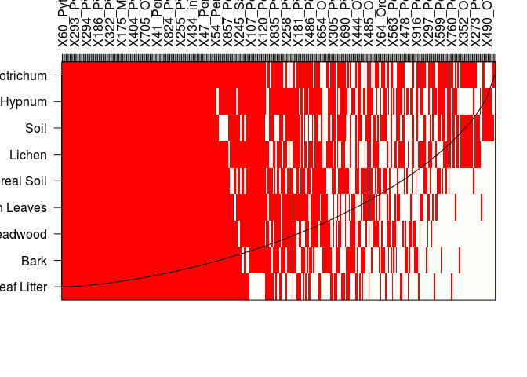
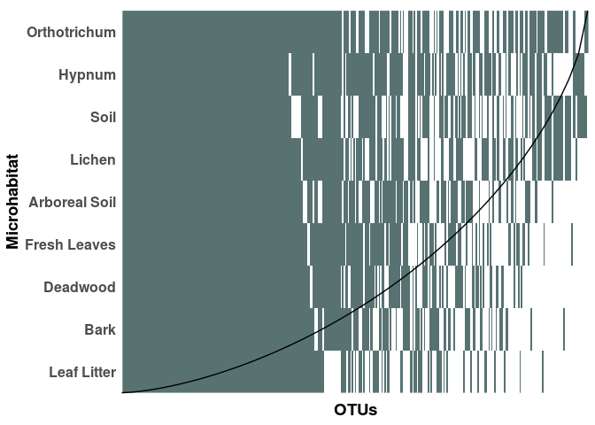

Nestedness Analysis
================

Nestedness can be observed when one community is the subset of another. Usually this is the case for island species, where migration from one island to another takes place. But here, it might be interesting to see if the community of a microhabitat - for example leaf litter - might be a subset of for example fresh leaf communites that have fallen from the canopy.

Prepare the Data
----------------

``` r
rm(list = ls())

library(ggplot2)
library(vegan)
library(plyr)
library(reshape2)
library(ggpubr)

#setwd("06_Incidence-based_Diversity/")

OTU_Table = as.data.frame(read.csv("../00_Data/Oomycota/05_OwnSamples_OTU_Table_min-freq-9588_transposed_withMetadata.tsv", 
                     header = T, 
                     sep = "\t", 
                     stringsAsFactors = T))

SampleMetadata = OTU_Table[,1:5]
Microhabitat = SampleMetadata$Microhabitat
OTU_Table = OTU_Table[,6:ncol(OTU_Table)]

Aggregated_Microhabitat = ddply(OTU_Table, "Microhabitat", numcolwise(sum))
rownames(Aggregated_Microhabitat) = Aggregated_Microhabitat$Microhabitat
Aggregated_Microhabitat = Aggregated_Microhabitat[,-1]
```

NestedTemp
----------

There is a function in the `vegan` package called `nestedtemp`. The function sorts the sites by species richness, plots the incidence of each OTU and then draws a line which represents the distribution pattern which would be observed if the communities were perfectly nested.

``` r
plot(nestedtemp(Aggregated_Microhabitat), kind = 'incid', names = T)
```



As this looks quite messy, we will now extract this information to plot it with `ggplot`

``` r
nest = nestedtemp(Aggregated_Microhabitat)

# get the presence-absence matrix
nest_long = melt(nest$comm)
colnames(nest_long) = c("Microhabitat", "OTUs", "Presence")
nest_long$Presence = as.factor(nest_long$Presence)

# nest$smooth gives the expected distribution for nested communities
# extract it and put it into relation with the length of the matrix
smooth_x = nest$smooth$x * length(colnames(nest$comm))
smooth_y = length(rownames(nest$comm)) - 
  ((nest$smooth$y) * length(rownames(nest$comm))) + 0.5
smooth_data = as.data.frame(cbind(smooth_x, smooth_y))

g = ggplot(nest_long, aes(x = OTUs, y = Microhabitat, fill = Presence)) + 
  geom_raster(alpha = 0.8, show.legend = F) + 
  scale_y_discrete(limits = rev(rownames(nest$comm))) +
  geom_line(data = smooth_data, aes(x = smooth_x, y = smooth_y),
            inherit.aes = F) + 
  scale_fill_manual(values = c("white", "darkslategrey")) + 
  theme_minimal() + 
  theme(axis.text.y=element_text(size=12, face = "bold"), 
        axis.title=element_text(size=14, face = "bold"), 
        axis.text.x = element_blank(), 
        panel.grid = element_blank())

g
```



The pattern clearly indicates that we observe *no* nestedness in our dataset. All communities are independent from each other, this is especially true for the canopy and ground. That means it is highly unlikely that the ground is just a subset of the canopy.

Cercozoa
--------

Now do the same for the Cercozoa:

``` r
OTU_Table_cerco = as.data.frame(read.csv("../00_Data/Cercozoa/05_Cercozoa_OwnSamples_OTU_Table_min-freq-15684_transposed_withMetadata.tsv", 
                     header = T, 
                     sep = "\t", 
                     stringsAsFactors = T))

SampleMetadata_cerco = OTU_Table_cerco[,1:5]
Microhabitat_cerco = SampleMetadata_cerco$Microhabitat
OTU_Table_cerco = OTU_Table_cerco[,6:ncol(OTU_Table_cerco)]

Aggregated_Microhabitat_cerco = ddply(OTU_Table_cerco, "Microhabitat_cerco", numcolwise(sum))
rownames(Aggregated_Microhabitat_cerco) = Aggregated_Microhabitat_cerco$Microhabitat
Aggregated_Microhabitat_cerco = Aggregated_Microhabitat_cerco[,-1]

nest_cerco = nestedtemp(Aggregated_Microhabitat_cerco)
nest_cerco_long = melt(nest_cerco$comm)
colnames(nest_cerco_long) = c("Microhabitat", "OTUs", "Presence")
nest_cerco_long$Presence = as.factor(nest_cerco_long$Presence)

smooth_x_cerco = nest_cerco$smooth$x * length(colnames(nest_cerco$comm))
smooth_y_cerco = length(rownames(nest_cerco$comm)) - 
  ((nest_cerco$smooth$y) * length(rownames(nest_cerco$comm))) + 0.5
smooth_data_cerco = as.data.frame(cbind(smooth_x_cerco, smooth_y_cerco))

g_cerco = ggplot(nest_cerco_long, aes(x = OTUs, y = Microhabitat, fill = Presence)) + 
  geom_raster(alpha = 0.8, show.legend = F) + 
  scale_y_discrete(limits = rev(rownames(nest_cerco$comm))) +
  geom_line(data = smooth_data_cerco, aes(x = smooth_x_cerco, y = smooth_y_cerco),
            inherit.aes = F) + 
  scale_fill_manual(values = c("white", "darkred")) + 
  theme_minimal() + 
  theme(axis.text.y=element_text(size=12, face = "bold"), 
        axis.title=element_text(size=14, face = "bold"), 
        axis.text.x = element_blank(), 
        panel.grid = element_blank())

g_cerco
```


``` r
combi = ggarrange(g_cerco, g, 
                  labels = c("A", "B"), 
                  ncol = 2, nrow = 1, 
                  align = "h")

#ggsave("NestedCombined.tif", plot = combi, 
#       device = "tiff", dpi = 300, width = 29.7, height = 16, 
#       units = "cm")
ggsave("NestedCombined.png", plot = combi, 
       device = "png", dpi = 600, width = 29.7, height = 16, 
       units = "cm")
ggsave("NestedCombined.pdf", plot = combi, 
       device = "pdf", dpi = 600, width = 29.7, height = 16, 
       units = "cm")

combi
```


