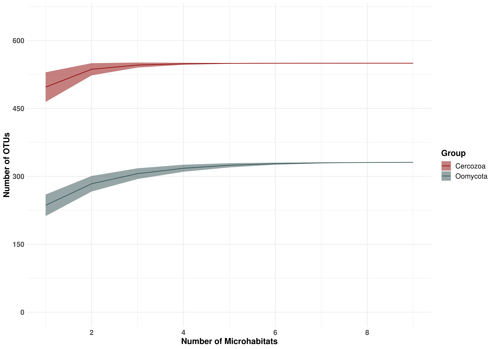

Species Accumulation Curves
================

A general pattern in community ecology is the increasing species richness with increasing number of distinct habitats. To check if this is also true for our Oomycota and Cercozoa, we will now plot a **Species Accumulation Curve**.

The `vegan` package contains a function that will do exactly this. But first we need to load the data and again aggregate OTUs by microhabitat:

``` r
rm(list = ls())

library(vegan)
library(ggplot2)
library(ggpubr)
library(plyr)

#setwd("06_Incidence-based_Diversity/")

OTU_Table = as.data.frame(read.csv("../00_Data/Oomycota/05_OwnSamples_OTU_Table_min-freq-9588_transposed_withMetadata.tsv", 
                     header = T, 
                     sep = "\t", 
                     stringsAsFactors = T))

SampleMetadata = OTU_Table[,1:5]
Microhabitat = SampleMetadata$Microhabitat
OTU_Table = OTU_Table[,6:ncol(OTU_Table)]

Aggregated_Microhabitat = ddply(OTU_Table, "Microhabitat", numcolwise(sum))
rownames(Aggregated_Microhabitat) = Aggregated_Microhabitat$Microhabitat
Aggregated_Microhabitat = Aggregated_Microhabitat[,-1]

## Load Cercozoa data

OTU_Table_cerco = as.data.frame(read.csv("../00_Data/Cercozoa/05_Cercozoa_OwnSamples_OTU_Table_min-freq-15684_transposed_withMetadata.tsv", 
                     header = T, 
                     sep = "\t", 
                     stringsAsFactors = T))

SampleMetadata_cerco = OTU_Table_cerco[,1:5]
Microhabitat_cerco = SampleMetadata_cerco$Microhabitat
OTU_Table_cerco = OTU_Table_cerco[,6:ncol(OTU_Table_cerco)]

Aggregated_Microhabitat_cerco = ddply(OTU_Table_cerco, "Microhabitat_cerco", numcolwise(sum))
rownames(Aggregated_Microhabitat_cerco) = Aggregated_Microhabitat_cerco$Microhabitat
Aggregated_Microhabitat_cerco = Aggregated_Microhabitat_cerco[,-1]
```

Calculate Species Accumulation
------------------------------

The function `specaccum` within the `vegan` package calculates the number of species which are unique for the added microhabitat, and therefore gives an estimation of the increasing species richness with increasing number of habitat types. It also gives a confidence interval (standard deviation).

We will extract all this information for our plot later:

``` r
accum = specaccum(Aggregated_Microhabitat)
accum_cerco = specaccum(Aggregated_Microhabitat_cerco)
Microhabitats = accum$sites
Microhabitats_cerco = accum_cerco$sites
Richness = accum$richness
Richness_cerco = accum_cerco$richness
StandardDeviation = accum$sd
StandardDeviation_cerco = accum_cerco$sd

df = as.data.frame(cbind(Microhabitats, 
                         Richness,
                         StandardDeviation))
df_cerco = as.data.frame(cbind(Microhabitats, 
                         Richness_cerco,
                         StandardDeviation_cerco))

# calculate the minimum and maximum species richness per microhabitat based on the standard deviation
df$min = df$Richness-df$StandardDeviation
df_cerco$min_cerco = df_cerco$Richness_cerco-df_cerco$StandardDeviation_cerco
df$max = df$Richness+df$StandardDeviation
df_cerco$max_cerco = df_cerco$Richness_cerco+df_cerco$StandardDeviation_cerco

colnames(df) = c("Microhabitats", "Richness", "StandardDeviation", 
                 "min", "max")
colnames(df_cerco) = c("Microhabitats", "Richness", "StandardDeviation", 
                 "min", "max")
df$Group = "Oomycota"
df_cerco$Group = "Cercozoa"

df_expanded = rbind(df, df_cerco)
```

Plot the curve
--------------

In our plot we will use a line as the species richness, and visualise the upper and lower boundary of the standard deviation with `geom_ribbon`:

``` r
g = ggplot(df_expanded, aes(x = Microhabitats)) + 
  geom_line(aes(y = Richness, colour = Group)) + 
  geom_ribbon(aes(ymin = min, ymax = max, 
              fill = Group), alpha = 0.5) + 
  theme_minimal() +
  labs(x = "Number of Microhabitats", 
       y = "Number of OTUs") + 
  scale_color_manual(values = c("darkred", "darkslategrey")) + 
  scale_fill_manual(values = c("darkred", "darkslategrey")) +
  scale_x_continuous(breaks = c(0, 2, 4, 6, 8)) +
  scale_y_continuous(breaks = c(0, 150, 300, 450, 600), limits = c(0, 650)) +
  theme(axis.text=element_text(size=12, face = "bold"), 
        axis.title=element_text(size=14, face = "bold"), 
        plot.title = element_text(size = 20, face = "bold", hjust = 0.5), 
        plot.subtitle = element_text(size = 14, hjust = 0.5), 
        legend.text = element_text(size = 12), 
        legend.title = element_text(size = 14, face = "bold"))

g
```



Interestingly we reach a plateu very fast, with only few sampled microhabitats. This means that - as we could see in the UpSetR Plot before - most OTUs are present in all habitats, and that there are only few OTUs uniquely present in samples with high richness.

``` r
#ggsave("SpeciesAccumulationCurve.tif", plot = g, 
#       device = "tiff", dpi = 600, width = 11.69, height = 8.27, 
#       units = "in")
ggsave("SpeciesAccumulationCurve.png", plot = g, 
       device = "png", dpi = 600, width = 11.69, height = 8.27, 
       units = "in")
ggsave("SpeciesAccumulationCurve.jpeg", plot = g, 
       device = "jpeg", dpi = 600, width = 11.69, height = 8.27, 
       units = "in")
ggsave("SpeciesAccumulationCurve.pdf", plot = g, 
       device = "pdf", dpi = 600, width = 11.69, height = 8.27, 
       units = "in")
```
