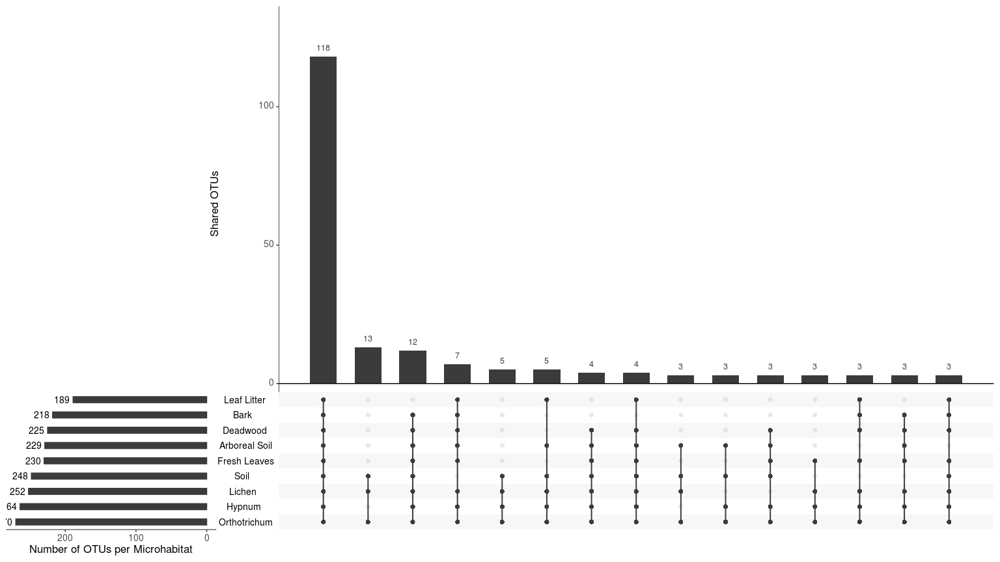
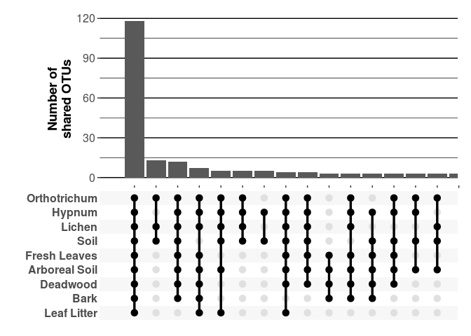
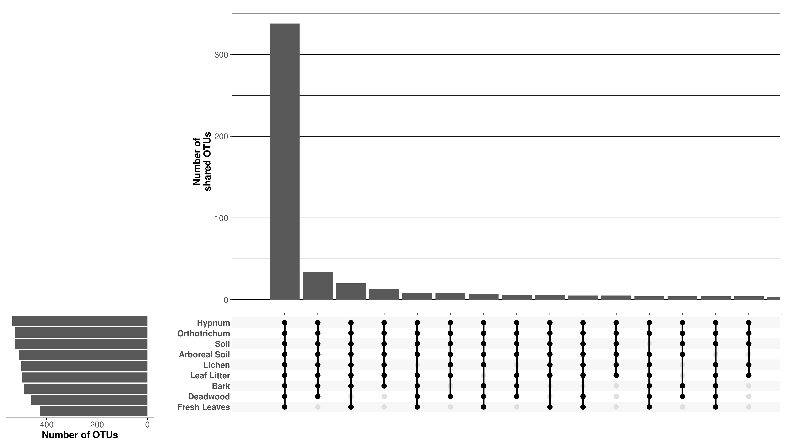

Visualise Shared OTUs
================

Often it makes sense to check which OTUs are present in which habitat. Even more interesting is how many OTUs are shared between habitats. When visualising shared quantities of different combinations, the most straightforward approach would be using a Venn diagram.

Venn diagrams, however, can get really messy when dealing with four or even five factors. But now imagine plotting a Venn diagram with *nine* microhabitats.

Luckily, there is an alternative: [UpSet Plots](https://caleydo.org/tools/upset/). There is also an implementation for R, which is called [UpSetR](https://cran.r-project.org/web/packages/UpSetR/vignettes/basic.usage.html) and, even better, a ggplot implementation called [ggupset](https://github.com/const-ae/ggupset), which we will use here.

Load Data
---------

First we need to load the data and required packages. Then we aggregate the replicates of the microhabitats, because we are only interested in the connections between the habitats and not the individual samples:

``` r
rm(list = ls())

library(vegan)
library(plyr)
library(ggpubr)
library(UpSetR)
library(ggupset)
library(tidyverse)
library(cowplot)

#setwd("06_Incidence-based_Diversity/")

OTU_Table = as.data.frame(read.csv("../00_Data/Oomycota/05_OwnSamples_OTU_Table_min-freq-9588_transposed_withMetadata.tsv", 
                     header = T, 
                     sep = "\t", 
                     stringsAsFactors = T))

SampleMetadata = OTU_Table[,1:5]
Microhabitat = SampleMetadata$Microhabitat
OTU_Table = OTU_Table[,6:ncol(OTU_Table)]

Aggregated_Microhabitat = ddply(OTU_Table, "Microhabitat", numcolwise(sum))
rownames(Aggregated_Microhabitat) = Aggregated_Microhabitat$Microhabitat
Aggregated_Microhabitat = Aggregated_Microhabitat[,-1]
Aggregated_Microhabitat[,] = ifelse(Aggregated_Microhabitat[,] > 0, 1, 0)
t_Aggregated_Microhabitat = as.data.frame(t(Aggregated_Microhabitat))
```

UpSetR
------

Before we use `ggupset`, let's have a look at the original `UpSetR` plot.

``` r
u = upset(t_Aggregated_Microhabitat, 
          nsets = 9, # Sets are the Microhabitats in this case
          order.by = "freq", # choose between frequency or degree
          decreasing = T, group.by = "sets", 
          nintersects = 15, # number of combinations to display
          empty.intersections = TRUE, 
          mainbar.y.label = "Shared OTUs", 
          sets.x.label = "Number of OTUs per Microhabitat", 
          text.scale = 1.5, set_size.show = T)

u
```



The left bar chart represents the number of OTUs in each microhabitat - which are sorted - and the top chart gives the number of shared OTUs for the combination represented by the matrix below.

That's already a neat representation, but I want more flexibility, which is why I use the `ggupset` package here:

Data preparation
----------------

As an input, we need a tibble. To generate a tibble from a presence/absence matrix, we need to convert it with using the `tidyverse` package:

``` r
Aggregated_Microhabitat_TF = ifelse(Aggregated_Microhabitat[,] > 0, 
                                    TRUE, FALSE)

tidy_Microhabitats = as_tibble(Aggregated_Microhabitat_TF, 
                               rownames = "Microhabitats") %>% 
  gather(OTU, Presence, -Microhabitats) %>% 
  filter(Presence) %>% 
  select(- Presence)

tidy_Dataframe = tidy_Microhabitats %>% 
  group_by(OTU) %>% 
  dplyr::summarise(shared_OTUs = list(Microhabitats))
```

`ggupset`
---------

Using ggupset is actually straightforward, because what it does is replacing the regular x-axis with a combination matrix using `scale_x_upset`. For the visualisation of the number of shared OTUs we use a simple bar chart, but you can use anything you want, for example a violin plot.

``` r
g = ggplot(tidy_Dataframe, aes(x = shared_OTUs)) +
  # plot the shard OTUs
  geom_bar() +
  geom_label(aes(label=..count..), 
             stat="count", 
             position=position_stack()) +
  # convert to combination matrix
  scale_x_upset() +
  # display only 15 intersections
  axis_combmatrix(xlim = c(0, 15.35)) +
  theme_combmatrix(combmatrix.label.make_space = F, 
                   combmatrix.label.text = element_text(size=12, 
                                                        face = "bold"),
                   axis.text.y = element_text(size = 12), 
                   axis.title=element_text(size=14, face = "bold"), 
                   panel.background = element_blank(),
                   plot.background = element_blank(),
                   panel.grid.major.y = element_line(colour = "black"), 
                   panel.grid.minor.y = element_line(color = "black"), 
                   panel.grid.major.x = element_blank(), 
                   panel.grid.minor.x = element_blank(), 
                   plot.margin = unit(c(0.5,0.5,0.5,1.8), "cm"))+ 
  labs(x = NULL, y = "Number of shared OTUs")

g
```



One in my opinion major drawback of `ggupset` is the missing left bar chart of the number of OTUs. But what we can do is plotting this separately and then combining the plots with the `cowplot` package:

``` r
tidy_Microhabitats$Microhabitats = factor(tidy_Microhabitats$Microhabitats, levels = rownames(as.data.frame(specnumber(Aggregated_Microhabitat) %>% sort())))

a = ggplot(tidy_Microhabitats, aes(x = Microhabitats)) + 
  geom_bar() + 
  coord_flip() +  
  scale_y_reverse() + 
  theme_minimal() + 
  labs(y = "Number of OTUs", x = NULL) + 
  theme(axis.text.y = element_blank(),
        axis.title.x = element_text(face = "bold", size = 14), 
        axis.text.x = element_text(size = 12), 
        axis.ticks.x = element_line(),
        axis.line.x = element_line(),
        axis.line.y = element_blank(), 
        panel.grid = element_blank(), 
        panel.background = element_blank(), 
        plot.background = element_blank())

ga = ggdraw() + 
  draw_plot(a, x = 0, y = 0, width = 0.2, height = 0.3) + 
  draw_plot(g, x = 0.2, y = 0.045, height = 0.955, width = 0.8)

ga
```


Interestingly, most OTUs are shared between all habitats. We have only a few combinations of microhabitats which harbour more than ten unique OTUs. This also indicates that we have no "specialists" exclusively present in one habitat or compartement. So all habitats seem to offer favourable conditions to all OTUs.

Cercozoa
--------

Now the same for the Cercozoa:

``` r
OTU_Table_cerco = as.data.frame(read.csv("../00_Data/Cercozoa/05_Cercozoa_OwnSamples_OTU_Table_min-freq-15684_transposed_withMetadata.tsv", 
                     header = T, 
                     sep = "\t", 
                     stringsAsFactors = T))

SampleMetadata_cerco = OTU_Table_cerco[,1:5]
Microhabitat_cerco = SampleMetadata_cerco$Microhabitat
OTU_Table_cerco = OTU_Table_cerco[,6:ncol(OTU_Table_cerco)]

Aggregated_Microhabitat_cerco = ddply(OTU_Table_cerco, "Microhabitat_cerco", numcolwise(sum))
rownames(Aggregated_Microhabitat_cerco) = Aggregated_Microhabitat_cerco$Microhabitat_cerco
Aggregated_Microhabitat_cerco = Aggregated_Microhabitat_cerco[,-1]

# make incidence based
Aggregated_Microhabitat_cerco[,] = ifelse(Aggregated_Microhabitat_cerco[,] > 0, 1, 0)
t_Aggregated_Microhabitat_cerco = as.data.frame(t(Aggregated_Microhabitat_cerco))

u_cerco = upset(t_Aggregated_Microhabitat_cerco, nsets = 9, 
          order.by = c("degree", "freq"),
          decreasing = T, group.by = "sets", 
          empty.intersections = TRUE, mainbar.y.label = "Shared OTUs", 
          sets.x.label = "Number of OTUs per Microhabitat", 
          text.scale = 1.5, set_size.show = F)

Aggregated_Microhabitat_cerco_TF = ifelse(Aggregated_Microhabitat_cerco[,] > 0, 
                                    TRUE, FALSE)
tidy_Microhabitats_cerco = as_tibble(Aggregated_Microhabitat_cerco_TF, rownames = "Microhabitats_cerco") %>% 
  gather(OTU_cerco, Presence_cerco, -Microhabitats_cerco) %>% 
  filter(Presence_cerco) %>% 
  select(- Presence_cerco)

tidy_Dataframe_cerco = tidy_Microhabitats_cerco %>% 
  group_by(OTU_cerco) %>% 
  dplyr::summarise(shared_OTUs_cerco = list(Microhabitats_cerco))

g_cerco = ggplot(tidy_Dataframe_cerco, aes(x = shared_OTUs_cerco)) +
  geom_bar() +
  geom_label(aes(label=..count..), 
             stat="count", 
             position=position_stack()) +
  scale_x_upset(sets = c("Leaf Litter", "Bark", "Deadwood", 
                         "Arboreal Soil", "Fresh Leaves", "Soil", 
                         "Lichen", "Hypnum", "Orthotrichum"), 
                n_intersections = Inf) +
  axis_combmatrix(xlim = c(0, 15.35)) +
  theme_combmatrix(combmatrix.label.make_space = F, 
                   combmatrix.label.text = element_text(size=12, 
                                                        face = "bold"),
                   axis.text.y = element_text(size = 12), 
                   axis.title=element_text(size=14, face = "bold"), 
                   panel.background = element_blank(), 
                   plot.background = element_blank(),
                   panel.grid.major.y = element_line(colour = "black"), 
                   panel.grid.minor.y = element_line(color = "black"), 
                   panel.grid.major.x = element_blank(), 
                   panel.grid.minor.x = element_blank(), 
                   plot.margin = unit(c(0.5,0.5,0.5,1.8), "cm"))+ 
  labs(x = NULL, y = "Number of shared OTUs")


tidy_Microhabitats_cerco$Microhabitats_cerco = factor(tidy_Microhabitats_cerco$Microhabitats_cerco, levels = rownames(as.data.frame(specnumber(Aggregated_Microhabitat_cerco) %>% sort())))

a_cerco = ggplot(tidy_Microhabitats_cerco, aes(x = Microhabitats_cerco)) + 
  geom_bar() + 
  coord_flip() +  
  scale_y_reverse() + 
  theme_minimal() + 
  labs(y = "Number of OTUs", x = NULL) + 
  theme(axis.text.y = element_blank(),
        axis.title.x = element_text(face = "bold", size = 14), 
        axis.text.x = element_text(size = 12), 
        axis.ticks.x = element_line(),
        axis.line.x = element_line(),
        axis.line.y = element_blank(), 
        panel.grid = element_blank(), 
        panel.background = element_blank(), 
        plot.background = element_blank())

ga_cerco = ggdraw() + 
  draw_plot(a_cerco, x = 0, y = 0, width = 0.2, height = 0.3) + 
  draw_plot(g_cerco, x = 0.2, y = 0.045, height = 0.955, width = 0.8)

ga_cerco
```



Combine both groups
-------------------

Now if you want to combine both groups of Cercozoa and Oomycota into one plot, here is a way to do it:

``` r
ga_cerco = ggdraw() + 
  draw_plot(a_cerco, x = 0, y = 0, width = 0.2, height = 0.49) + 
  draw_plot(g_cerco, x = 0.2, y = 0.045, height = 0.955, width = 0.8)

ga = ggdraw() + 
  draw_plot(a, x = 0, y = 0, width = 0.2, height = 0.485) + 
  draw_plot(g, x = 0.2, y = 0.045, height = 0.955, width = 0.8)

combi = ggarrange(ga_cerco, ga, 
                  labels = c("A", "B"), 
                  ncol = 1, nrow = 2, 
                  vjust = 2,
                  #common.legend = T, legend = "right", 
                  align = "v")

combi$theme$plot.background = element_blank()
combi$theme$panel.background = element_blank()


ggsave("UpSetRCombined.pdf", plot = combi, 
       device = "pdf", dpi = 600, width = 19, height = 26, 
       units = "cm")
ggsave("UpSetRCombined.tif", plot = combi, 
       device = "tiff", dpi = 600, width = 19, height = 26, 
       units = "cm")
ggsave("UpSetRCombined.png", plot = combi, 
       device = "png", dpi = 600, width = 19, height = 26, 
       units = "cm")
```
